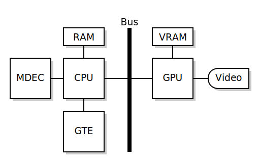

# 1.1. Setting up Graphics and Hello World

This chapter teaches the basics of initializing and setting up the GPU
of the PSX. Areas covered in this chapter include the GPU, VRAM and the
concept of display and drawing environments which are essential for
better understanding how the GPU works when programming for the PSX.

This tutorial series does not and will not cover graphics programming
using the LIBGS library which is a high level graphics library that adds
about 100KB worth of overhead to your project (remember that the PSX
only has 2MB of RAM) and hides many of the inner workings of the GPU,
making it difficult to understand how to use the GPU directly and would
often get in the way when trying to write your own graphics routines\...
While it may sound elitist discouraging the use of LIBGS as it provides
facilities for rendering 3D models easily, it is better to learn how to
work with LIBGPU (or PSXGPU in PSn00bSDK) in the long term as the
knowledge gained from learning how to use it directly will become very
important in the future for either better performance, or to accomplish
special graphical effects.

**Tutorial compatible with PSn00bSDK:** Yes

## Chapter Index

-   [Why Start with Graphics?](#why-start-with-graphics)
-   [Brief Summary of the GPU](#brief-summary-of-the-gpu)
-   [Writing the Hello World Program](#writing-the-hello-world-program)
-   [Setting up Graphics](#setting-up-graphics)
-   [Displaying the Hello World](#displaying-the-hello-world)
-   [Final Sample Code](#final-sample-code)
-   [Result](#result)
-   [Conclusion](#conclusion)

## Why Start with Graphics?

This tutorial series begins with graphics programming as displaying a
hello world message requires a bit of graphics programming, as neither
the official SDK or PSn00bSDK provide a framebuffer text console for
displaying text largely due to the way how the hardware works. But both
provide a means of basic text drawing functions intended for debugging
purposes which will be demonstrated for this chapter.

Besides, most of the satisfaction gained when learning to develop for a
new platform comes from seeing the result displayed on the television
screen by the console you\'re learning to develop for and you\'re going
need to learn graphics programming anyway to really be able to do
anything interesting with the PSX. It is a **video** game console
afterall.

## Brief Summary of the GPU

The GPU, as the name suggests, is the graphics processor responsible for
doing the graphics rendering work for both 2D and 3D visuals. The block
diagram shown below illustrates the relevant components that make up the
entirerity of the PSX\'s graphics subsystem, including the MDEC and GTE
hardware responsible for video playback and 3D graphics capabilities
respectively.

- 1MB of VRAM with 16-bit data bus.
- 2KB of texture cache.
- Supports non-interlaced, low resolution and interlaced, high
  resolution video modes.
- 16-bit color rendering with optional dithering.
- Draws rectangles, sprites, lines, polylines, flat, shaded and
  texture mapped polygon primitives.
- Estimated 300,000 flat and gouraud shaded polygons per second.
- Estimated 150,000 texture mapped polygons per second.

### The GPU is not 3D

A worrying amount often believed that the PSX\'s GPU is capable of
rendering 3D polygons. While it may seem to be the case to the
uneducated, the GPU is in fact only capable of drawing primitives in 2D
space. Therefore, the GPU is incapable of perspective correct texture
mapping which results in affine texture distortion and the occasional
buggy near clipping seen in a lot of 3D PSX games. It was common for
games to minimize the distortion by subdividing large polygons into
smaller polygons with perspective correct subdivision.

The bulk of the 3D processing is instead done on the CPU which features
a co-processor suited for such tasks known as the GTE or Geometry
Transform Engine. The GTE is effectively an all integer math
co-processor that provides matrix multiplication, vector transformations
and projection operations at high speed which the CPU alone couldn\'t do
at reasonable speed. Software would then assemble primitive packets
using results from the GTE which are then sent to the GPU as a linked
list via high speed DMA transfer for the GPU to draw said primitives.

The GTE will not be covered in this chapter as it is not required for
simple 2D graphics programming. Whilst in the topic of the GTE, a very
important issue must be taken care of and that is the GTE is **NOT** a
Geometry *Transfer* Engine. An equally concerning amount belive that the
GTE stands for Geometry Transfer Engine and not a Transform Engine when
in fact, the GTE only does math calculations and is not capable of doing
any *\"transfer\"* operations whatsoever. Also, the GTE can only be
accessed by the CPU through standard co-processor related instructions.
Just wanted to clarify this before going any further in learning how to
program for the PSX as this bothers me to no end. Suppose it can be used
to identify if one is a real PSX programmer or not.

### Only 16-bit Color Rendering

Some often mistake that the PSX renders graphics in 24-bit color depth.
Whilst the GPU is capable of 24-bit true color output, it cannot draw
primitives in 24-bit color. So the 24-bit color mode is only really
useful for MDEC video sequences or static images in 24-bit color.

The GPU can only draw at 16-bit color depth in a RGB5I1 pixel format
(five bits per RGB component plus one mask bit used as a mask for
semi-transparency effects). This aligns perfectly with the 16-bit data
bus of the VRAM.

### The VRAM

The GPU features it\'s own 1MB of VRAM. If you look back at the block
diagram shown earlier you\'ll see that the VRAM is connected to the GPU
and is not connected the system bus at all. This means the VRAM is not
memory mapped and the CPU cannot access it directly. Instead, VRAM
access can only be done through the GPU. Fortunately, transfers are done
via high speed DMA.

Naturally, the GPU uses the VRAM for storing framebuffers and texture
images. The most interesting aspect about the VRAM is how the GPU treats
it like a 1024x512 16-bit image, with areas of VRAM addressed by (X,Y)
coordinates instead of a linear memory address range. Display and
drawing framebuffers as well as texture images reside as rectangular
images in the VRAM. The following illustrates a typical VRAM layout for
framebuffers and texture images in PSX games.

### Primitive Packets

The GPU is instructed through the use of primitive packets, which are
small bits of formatted data that make up a GPU command which are sent
to the GPU via DMA for drawing. The primitive packets not only specify
the type of primitive but also the color, semi-transparency flags, (X,Y)
coordinates, texture coordinates, color look-up table to use and so
forth. Think of them like arguments for a function call.

The number of arguments a primitive packet requires depends on the type
of primitive. The simplest primitives such as a texture page primitive
only takes one argument while the most sophisticated primitive; a
texture mapped, gouraud shaded, 4-point polygon takes as many as 14
arguments. This also means the size of the primitive varies, with the
texture page primitive being only a word in size while a 4-point,
texture mapped and gouraud shaded polygon is 12 words long on top of the
tag word present at the start of all primitives.

Further details about primitive packets will be covered in a future
chapter.

### Framebuffers

Framebuffers for graphics display and drawing reside in VRAM as
rectangular areas defined in (X,Y) coordinates. The size of the display
area is based on the video mode (ie. the display area is 320x240 pixels
when running in 320x240 mode). On the other hand, the size for the
drawing area can be of any arbitrary size which may be used to render
texture images for accomplishing certain render to texture based visual
effects. Normally, the size of the drawing area should typically be
equal to the display area.

The display and drawing areas are defined as an environment using the
**DISPENV** and **DRAWENV** structs. Each struct defines various
parameters that are relevant to their respective environment. The
**DISPENV** and **DRAWENV** structs are initialized using
**SetDefDispEnv()** and **SetDefDrawEnv()** respectively which defines
the default parameters for each environment, which may be customized
later for your project\'s requirements. Once the environments have been
defined they can then be applied to the GPU using **PutDispEnv()** and
**PutDrawEnv()** to make each environment effective.

Learning the display and drawing environments are mandatory for being
able to get any graphical output from the PSX and this will be covered
extensively in this chapter.

## Writing the Hello World Program

As obligatory as it may sound, a hello world is an effective and simple
enough example to get started with PSX homebrew programming. A hello
world program for the PSX can\'t be a simple call of printf(), unless
you only want to see the output through a tty which, in all honesty,
won\'t look as interesting as showing the message on the TV screen or
emulator window.

The basic run-down of accomplishing a hello world on the PSX is to
perform the following operations:

- Initialize the GPU.
- Define display and drawing environments.
- Initializing the debug font.
- Display the hello world text.

Break out your preferred text editor and begin writing the hello world
program as you go along this chapter.

### Required Headers

First, include some necessary headers in your C file. The most important
of which is libgpu.h as it provides various definitions provided by the
libgpu library. libgte.h is required even if you don\'t plan to use the
GTE as libgpu.h depends on some definitions provided in it.

    #include <sys/types.h>   // This provides typedefs needed by libgte.h and libgpu.h
    #include <stdio.h>    // Not necessary but include it anyway
    #include <libetc.h>   // Includes some functions that controls the display
    #include <libgte.h>   // GTE header, not really used but libgpu.h depends on it
    #include <libgpu.h>   // GPU library header

If using PSn00bSDK, replace the **lib** prefix with **psx** instead.
Most of the definitions between the official SDK and PSn00bSDK are
identical, so the syntax of things shouldn\'t be much to worry much
about.

### Write the main() Function

Like with any C program, you must define a main() function somewhere in
your project. You can omit the argc and argv definitions if desired as
they don\'t work on the PSX.

    int main()
    {
        return 0;
    }

A return value cannot be passed to a parent executable as the kernel
does not save the value for the caller to receive it, but is required
nonetheless to keep the compiler from complaining about returning
without a value.

## Setting up Graphics

The very first thing to do before anything else in your PSX program is
to call **ResetGraph()**. **ResetGraph()** not only resets the GPU as
the name suggests, but it also enables interrupts which are mandatory
for getting anything done on the PSX. If **ResetGraph()** is not called
functions that depend on interrupts such as **VSync()** and several
other things will not work, and will usually appear as though your
program just crashed.

    // Reset GPU and enable interrupts
    ResetGraph(0);

Resetting the GPU also masks out the video output which results in a
black screen, but the console still produces video sync. The video
output is enabled again using **SetDispMask()**, ideally after a
**DISPENV** has been defined and applied to the GPU for a smooth
transition from a previously running program (ie. the startup screen).
As **ResetGraph()** does not clear the contents of VRAM, so whatever was
drawn by the previous program still remains when your program takes
over. Clearing the VRAM is generally not required in most well coded
scenarios.

### Setting up the DISPENV and DRAWENV Environments

Start by defining two **DISPENV** and **DRAWENV** variables as arrays in
your code. Define an int which will be used for keeping track of things
which will make total sense later on. This value must be set to zero as
part of your graphics initialization code just to make sure the variable
starts with a value of zero.

    // Define environment pairs and buffer counter
    DISPENV disp[2];
    DRAWENV draw[2];
    int db;

Next is to define the **DISPENV** pair. Initializing the **DISPENV**
structure is easiest done using the **SetDefDispEnv()** function with
simple arguments.

**For NTSC users:**

    // Configures the pair of DISPENVs for 320x240 mode (NTSC)
    SetDefDispEnv(&disp;[0], 0, 0, 320, 240);
    SetDefDispEnv(&disp;[1], 0, 240, 320, 240);

**For PAL users:**

    // Configures the pair of DISPENVs for 320x256 mode (PAL)
    SetDefDispEnv(&disp;[0], 0, 0, 320, 256);
    SetDefDispEnv(&disp;[1], 0, 256, 320, 256);

    // Screen offset to center the picture vertically
    disp[0].screen.y = 24;
    disp[1].screen.y = disp[0].screen.y;

    // Forces PAL video standard
    SetVideoMode(MODE_PAL);

This defines both **DISPENV**s for 320x240 resolution mode (320x256 if
you used the PAL snippet) which is the most commonly used video mode.
The first **DISPENV** is set with a position of (0,0) while the second
**DISPENV** is set with a VRAM offset of (0,240). You might be wondering
why it has to be defined that way.

Next is to define the **DRAWENV**s. Much like the **DISPENV**s you use
**SetDefDrawEnv()** to initialize the **DRAWENV** structure with simple
arguments.

**For NTSC users:**

    // Configures the pair of DRAWENVs for the DISPENVs
    SetDefDrawEnv(&draw;[0], 0, 240, 320, 240);
    SetDefDrawEnv(&draw;[1], 0, 0, 320, 240);

**For PAL users:**

    // Configures the pair of DRAWENVs for the DISPENVs
    SetDefDrawEnv(&draw;[0], 0, 256, 320, 256);
    SetDefDrawEnv(&draw;[1], 0, 0, 320, 256);

Unlike **DISPENV**, **DRAWENV** can be of any arbitrary size for the
drawing environment. But generally it should be equal to the size of the
**DISPENV** defined, so the drawn area will align perfectly with the
display environments. Additionally, you\'ll want to set some parameters
within the **DRAWENV** struct to enable background clearing as otherwise
you\'ll get a hall of mirrors effect. The background clear takes effect
as soon as the **DRAWENV** is applied to the GPU using **PutDrawEnv()**.

    // Specifies the clear color of the DRAWENV
    setRGB0(&draw;[0], 63, 0, 127);
    setRGB0(&draw;[1], 63, 0, 127);
    // Enable background clear
    draw[0].isbg = 1;
    draw[1].isbg = 1;

Finally, apply the **DISPENV**/**DRAWENV** environments to the GPU to
apply the new video mode and drawing environment to achieve a seamless
transition.

    // Apply environments
    PutDispEnv(&disp;[0]);
    PutDrawEnv(&draw;[0]);

To keep your code look neat and tidy, you\'ll want to put all the
graphics init code inside a function, to keep your **main()** function
from looking messy and will make expanding the program easier in the
future.

### The Concept of Double Buffered Rendering

You may have noticed that the **DRAWENV** pairs are somewhat positioned
in the opposite order as the **DISPENV** whilst writing the graphics
init code and are probably wondering why this is the case instead of a
**DRAWENV** directly overlapping a **DISPENV**. This is how you
implement double buffered rendering on the PSX and is a standard feature
to have when writing real-time graphics code, not just on the PSX but on
almost any system with a framebuffer.

If you\'re not familiar with the concept, you basically need to allocate
two framebuffer areas; one for display and one for drawing. The way you
use these framebuffers is you use one buffer as the display buffer,
which is the buffer the graphics hardware will display on the screen and
the other as the drawing buffer, where all your graphics operations
should draw to and is not shown on the screen. Once drawing is complete
the two buffers switch places, the drawing buffer becomes the display
buffer and the display buffer become the drawing buffer for the next
frame to be drawn and the cycle repeats. This basically guarantees that
only completed frames are shown on the screen which yields seamless
graphical animations even during framerate drops when intensive visuals
are being drawn aside from the natural reduction of smoothness.

Having a **DISPENV** and a **DRAWENV** simply overlap one another on the
same area counts as single buffered rendering and whilst you may get
away with it, the amount of things you can draw/process will be severely
limited as you\'ll get nasty flicker if the drawing/processing does not
complete before the v-blank period ends. So, a double buffered rendering
scheme is much preferred.

### The Display Function

Now the last thing that deals with the **DISPENV** and **DRAWENV**
environments to write is a so called display function, which is
basically a function that does the all buffer swap stuff in a single
call for convenience. Calling the display function should be done at the
end of your loop as that is usually where all graphics operations have
completed and are ready for drawing or display. For this tutorial, the
display function will be named display().

Before performing a buffer swap, you must first call **DrawSync()** then
**VSync()**. As the names suggests these functions waits for the GPU to
complete any drawing operations and waits for the vertical blanking
period respectively. Waiting for **DrawSync()** is important as it makes
sure that the GPU has completed drawing any primitives as otherwise you
may get flicker or possibly instability. Waiting for **VSync()** is also
important as it not only caps your program loop to the TV refresh rate
(60fps for NTSC, 50 for PAL) but it also prevents screen tearing which
will happen if you swap buffers without waiting for the v-blank period.

    // Wait for GPU to finish drawing and V-Blank
    DrawSync(0);
    VSync(0);

Now the next step is to perform the buffer swap. If you remember that
variable named db earlier, this variable will be used as a counter to
keep track of which buffer pair to switch to. Since there are only two
**DISPENV** and **DRAWENV** pairs this variable will simply alternate
between 1 and 0 on every call of the display function. This easily
achieved using a NOT (!) operator.

    // Flip buffer counter
    db = !db;

Then apply the environment pair based on the value of db to the GPU.

    // Apply environments
    PutDispEnv(&disp;[db]);
    PutDrawEnv(&draw;[db]);

And finally, call **SetDispMask()** to lift the display mask so you get
picture instead of a black screen, as **ResetGraph()** masks the display
by default.

    // Enable display
    SetDispMask(1);

### Verifying the Code

To make sure you\'re right on track, here\'s a listing of what the code
should look like.

    #include <sys/types.h>   // This provides typedefs needed by libgte.h and libgpu.h
    #include <stdio.h>    // Not necessary but include it anyway
    #include <libetc.h>   // Includes some functions that controls the display
    #include <libgte.h>   // GTE header, not really used but libgpu.h depends on it
    #include <libgpu.h>   // GPU library header

    // Define environment pairs and buffer counter
    DISPENV disp[2];
    DRAWENV draw[2];
    int db;

    void init(void)
    {
        // Reset GPU and enable interrupts
        ResetGraph(0);
        
        // Configures the pair of DISPENVs for 320x240 mode (NTSC)
        SetDefDispEnv(&disp;[0], 0, 0, 320, 240);
        SetDefDispEnv(&disp;[1], 0, 240, 320, 240);
        
        // Configures the pair of DRAWENVs for the DISPENVs
        SetDefDrawEnv(&draw;[0], 0, 240, 320, 240);
        SetDefDrawEnv(&draw;[1], 0, 0, 320, 240);
        
        // Specifies the clear color of the DRAWENV
        setRGB0(&draw;[0], 63, 0, 127);
        setRGB0(&draw;[1], 63, 0, 127);
        
        // Enable background clear
        draw[0].isbg = 1;
        draw[1].isbg = 1;
        
        // Apply environments
        PutDispEnv(&disp;[0]);
        PutDrawEnv(&draw;[0]);

        // Make sure db starts with zero
        db = 0;
    }

    void display(void)
    {
        // Wait for GPU to finish drawing and V-Blank
        DrawSync(0);
        VSync(0);
        
        // Flip buffer counter
        db = !db;
        
        // Apply environments
        PutDispEnv(&disp;[db]);
        PutDrawEnv(&draw;[db]);
        
        // Enable display
        SetDispMask(1);
    }

    int main()
    {
        // Initialize graphics and stuff
        init();
        
        // Main loop
        while(1)
        {
            display();
        }
        
        return 0;
    }

### Compiling and Testing

Now that you\'ve written a considerable amount of code for the graphics
init and buffer swapping stuff, it should be possible to compile the
code and see an output to check if you\'re right on track. In the
official PsyQ/Programmers\' Tool SDK compiling can be done through
**ccpsx** with a single command line. **ccpsx** is actually a front for
the C, C++ and linker that makes using the SDK\'s toolchain easier.

    ccpsx -O2 -Xo0x80010000 hello.c -o hello.cpe

If you\'ve worked with C before, you should already know that -O2
specifies the optimization level for the compiler generated code just
like in most other C compilers. The -Xo0x80010000 parameter would likely
be unfamiliar to you and this specifies the target address your
executable\'s program text is going to reside when it is being loaded by
the console. The target address is usually set to 0x80010000 which is
the start of user space memory on the PSX as the first 64KB is reserved
by the kernel.

The executables **ccpsx** produces are in CPE format which cannot be
booted from the CD by the PSX and most emulators don\'t support it.
You\'ll have to convert the executable into the usable PS-EXE format
which can be done using **cpe2x**.

    cpe2x hello.cpe

Don\'t be fooled by the .EXE file extension of a PS-EXE executable file.
The executable files **cpe2x** produces are neither MS-DOS or Windows
executable programs.

If using PSn00bSDK. It is more complicated to compile a program from
within the command line alone due to the way how the toolchain is
currently set up. It is much easier to just copy a makefile from one of
the examples included in the SDK and tweak the variables for your
project. Then use **make** to compile the program and it should produce
an ELF file and a PS-EXE file.

Run the program and you should get a solid blue image.

## Displaying the Hello World

Now that the graphics environment and display routines have been
implemented, the next step is to draw the hello world message. This is
easily done by using the debug font functions **FntLoad()**,
**FntOpen()** and **FntPrint()**. These functions are not suited for
general use. Such as in a game title as it does not support any form of
customization and does not support lowercase letters, but is good enough
for testing and debugging purposes which will be useful later. These
functions are provided by libetc, or psxetc in PSn00bSDK.

### Setting up the Debug Font

The first thing to do before the debug font functions can be used is to
is load the font texture onto VRAM using **FntLoad()**. The font texture
can be placed anywhere in the VRAM area provided it doesn\'t get
overwritten by display/draw areas, or textures being loaded onto VRAM.
For this tutorial, the font texture will be placed at (960,0).

Next is to create a text stream using **FntOpen()** which defines the
area where the text will be drawn at. For this tutorial a text stream of
100 characters is defined to fill the entire screen, with some overscan
compensation to ensure that the text is visible on the TV.

    // Load the internal font texture
    FntLoad(960, 0);
    // Create the text stream
    FntOpen(0, 8, 320, 224, 0, 100);

The font area coordinates are draw-area relative and not VRAM relative,
so there is no need to define another font area for each of the
display/draw areas in the VRAM. The third argument specifies if a black
background for the font area should be drawn. In PSn00bSDK, you can
specify 2 for a semi-transparent black background. If you try to set it
to a non-zero value, the background will turn black because the font
area covers the entire screen.

**FntOpen()** allows defining multiple font areas by saving the return
value to a persistent variable and passing it as the first argument of
**FntPrint()** and **FntFlush()**. Up to eight font areas can be defined
at once, but it cannot be closed or redefined later in your program.

### Printing and Displaying Hello World

**FntPrint()** prints text to the last defined font area and works more
or less like **printf()** and you can also use the newline character
sequence \\n to move a line of text down. A font handle can be specified
as an optional first argument of **FntPrint()**, but in PSn00bSDK a
handle from **FntOpen()** or -1 must be specified as the first argument.
This

    FntPrint("HELLO WORLD!");

    FntFlush(-1);
    display();

Calling **FntPrint()** alone is not enough to display text to the
current draw area, so **FntFlush()** needs to be called to actually draw
the characters printed from **FntPrint()** calls.

## Final Sample Code

Compare your code against this listing to make sure you\'re right on
track.

    #include <sys/types.h>   // This provides typedefs needed by libgte.h and libgpu.h
    #include <stdio.h>    // Not necessary but include it anyway
    #include <libetc.h>   // Includes some functions that controls the display
    #include <libgte.h>   // GTE header, not really used but libgpu.h depends on it
    #include <libgpu.h>   // GPU library header

    // Define environment pairs and buffer counter
    DISPENV disp[2];
    DRAWENV draw[2];
    int db;

    void init(void)
    {
        // Reset GPU and enable interrupts
        ResetGraph(0);
        
        // Configures the pair of DISPENVs for 320x240 mode (NTSC)
        SetDefDispEnv(&disp;[0], 0, 0, 320, 240);
        SetDefDispEnv(&disp;[1], 0, 240, 320, 240);
        
        // Configures the pair of DRAWENVs for the DISPENVs
        SetDefDrawEnv(&draw;[0], 0, 240, 320, 240);
        SetDefDrawEnv(&draw;[1], 0, 0, 320, 240);
        
        // Specifies the clear color of the DRAWENV
        setRGB0(&draw;[0], 63, 0, 127);
        setRGB0(&draw;[1], 63, 0, 127);
        
        // Enable background clear
        draw[0].isbg = 1;
        draw[1].isbg = 1;
        
        // Apply environments
        PutDispEnv(&disp;[0]);
        PutDrawEnv(&draw;[0]);

        // Make sure db starts with zero
        db = 0;
        
        // Load the internal font texture
        FntLoad(960, 0);
        // Create the text stream
        FntOpen(0, 8, 320, 224, 0, 100);
    }

    void display(void)
    {
        // Wait for GPU to finish drawing and V-Blank
        DrawSync(0);
        VSync(0);
        
        // Flip buffer counter
        db = !db;
        
        // Apply environments
        PutDispEnv(&disp;[db]);
        PutDrawEnv(&draw;[db]);
        
        // Enable display
        SetDispMask(1);
    }

    int main()
    {
        // Initialize graphics and stuff
        init();
        
        // Main loop
        while(1)
        {
            FntPrint("HELLO WORLD!");

            FntFlush(-1);
            display();
        }
        
        return 0;
    }

## Result

Run the program on the console or emulator and you should see a dark
purple picture:

## Conclusion

This concludes this chapter of Lameguy64\'s PSX Tutorial series. You
should be very familiar of how framebuffers are handled on the PSX
hardware and should be ready to take on drawing proper graphics
primitives.

A few things you may want to experiment with this example yourself:

-   Try ordering the areas side by side.
-   Go to the VRAM/GPU Viewer in no\$psx or press F12 in PSXfin to
    visually see the buffers in action. This also works for retail
    games.
-   Play around with the clear color values on the **DRAWENV**
    environments. Make sure the color values on both **DRAWENV**
    elements are the same otherwise intense flickering will occur.

The next tutorial will cover how to draw graphics with the GPU using
ordering tables and primitive packets.

---

[Back to Index](index.md)    |    [Next](chapter_1_2.md)

---
