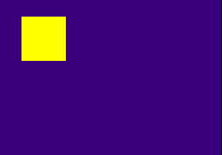

# 1.2. Drawing Graphics

This tutorial will teach you how to draw graphics primitives with the
GPU using an ordering table and primitive packets. This is a very
essential part to learn about the PS1 as you need graphics to do
anything on the console really.

Just like in the last tutorial, libgs will not be covered here. Also,
the GPU is not responsible for 3D graphics. While it does render out
(affine) polygon all the 3D processing is actually done in a
co-processor, called the GTE or Geometry Transformation Engine.

***Trivia:*** The easiest way to tell if a person is not a PS1
programmer is if they call the GTE the Geometry *Transfer* Engine
instead of **Transformation** Engine. The GTE does NOT transfer
anything, it is essentially like a math co-processor on the CPU as
nothing but the CPU has access to it, and it does nothing else but
vector transformations that helps greatly in 3D graphics processing.

**Tutorial compatible with PSn00bSDK:** Yes

## Tutorial Index

-   [Theory of Operation](#theory-of-operation)
-   [Ordering Tables](#ordering-tables)
-   [Primitive Packets](#primitive-packets)
-   [Preparing a Primitive](#preparing-a-primitive)
-   [Primitive Buffers](#primitive-buffers)
-   [Sorting a Primitive to an Ordering Table](#sorting-a-primitive-to-an-ordering-table)
-   [Drawing an Ordering Table](#drawing-an-ordering-table)
-   [Double Ordering Tables/Primitive Buffers](#double-ordering-tablesprimitive-buffers)
-   [Sample Code](#sample-code)
-   [Conclusion](#conclusion)

## Theory of Operation

The PS1 GPU draws graphics by means of primitive packets, which are
essentially messages that command the GPU to draw a specified primitive
in a specified color to specified screen coordinates to name a few.

Drawing packets are normally sent to the GPU by an ordering table, which
is essentially an array of pointers that form a chain. Primitive packets
are normally linked to the ordering table to draw them.

## Ordering Tables

An ordering table is an array of elements of pointers that point from
one element to another, the ordering table usually ends with an array
element with the value of 0xFFFFFFFF which is used as a terminator value
for ordering table processing. An ordering table is normally created
using **ClearOTagR()** on an array of 32-bit ints.

The following figure visually describes the general structure of an
ordering table.

Adding primitives to an ordering table is normally achieved using
**addPrim()/AddPrim()** functions. **DrawOTag()** is used to begin
processing of an ordering table.

The type of ordering table shown above is called a reverse ordering
table because the chain starts at the end of the array and ends at the
beginning of the array. This type of ordering table is most commonly
used as the reverse order allows for depth ordering of polygons which is
essential for 3D graphics. Use **ClearOTag()** if you wish to use a
non-reverse ordering table but the initialization speed won\'t be as
fast as **ClearOTagR()** for larger tables as **ClearOTagR()** is DMA
accelerated, but it can only generate reverse ordering tables.

For simplicity, a global ordering table array of 8 elements should
suffice for this tutorial.

    int ot[2][8];

The reason two arrays of ot are defined is for double buffered rendering
reasons, which will be explained later in this tutorial.

## Primitive Packets

Primitive packets are more or less commands that instruct the GPU to
draw a specified primitive to specified coordinates of the drawing area
carried by the packet. Primitive packets are always aligned 4-byte
aligned.

The following illustrates the typical structure of a primitive packet
(the packet represents a **SPRT** primitive):

C implementation of the above structure

    typedef struct {
        unsigned int  tag;             // First 24 bits are address, last 8 bits are length
        unsigned char  r0,g0,b0,code;  // RGB color and primitive code
        short          x0,y0;          // X,Y coordinates of sprite
        unsigned char  u0,v0;          // U,V texture coordinates of sprite
        unsigned short clut;           // Texture CLUT
        unsigned short w,h;            // Sprite width and height
    } SPRT;

The number of parameter words of a primitive packet varies on the
primitive command. Simpler commands such as a fixed sized, solid color
sprite is only 3 words long whereas a shaded, textured 4-point polygon
is 13 words long, the length of the primitive in words is specified to
the *Len* field minus the tag word. The *Next Pointer* field is an
address to the next primitive or return pointer to an ordering table it
was sorted to.

A word in this context is a 4 byte integer.

Primitives are normally defined using primitive structures and macros
defined in libgpu.h, or psxgpu.h in PSn00bSDK.

## Preparing a Primitive

Primitive packets are normally prepared using primitive structures and
macros. A solid color rectangular sprite (**TILE**) will be used for
this tutorial.

Primitive preparation is as follows.

    TILE tile;                      // Primitive structure

    setTile(&tile;);                 // Initialize the primitive (very important)
    setXY0(&tile;, 32, 32);          // Set primitive (x,y) position
    setWH(&tile;, 64, 64);           // Set primitive size
    setRGB0(&tile;, 255, 255, 0);    // Set color yellow

The **setTile()** macro simply fills in the appropriate values to the
tag length and primitive code fields to the specified primitive. These
values are mandatory and must be correct, otherwise the GPU will lock
up. Always use the appropriate initializer macro for a primitive.

The **setXY0()**, **setWH()** and **setRGB0()** macros sets the (x,y)
coordinates, size and color of the primitive respectively. While the
fields of a primitive can be set directly via struct elements of the
primitive, using macros helps make the code looking tidy.

Normally, primitive packets are defined to a primitive buffer.

## Primitive Buffers

A primitive buffer is simply a global array of char elements used as a
buffer to define primitive packets to. It is also a lot less wasteful
than defining multiple arrays for different primitive types as all
primitive types can be defined in just a single global buffer.

The reason it is recommended that primitive packets must be defined in a
global buffer is because the primitives must exist in memory until the
GPU gets around to processing it. If you were to define primitives as a
local variable in a function and register it to an ordering table, that
primitive has most likely been overwritten by other things (since locals
are generally temporary variables), resulting in a corrupted ordering
table which would result to a GPU lock up or crash.

A primitive buffer can be defined as such, 32KB buffer for primitives
should be plenty.

    char primbuff[2][32768];
    char *nextpri;

The nextpri variable will be used to keep track where the next primitive
should be written to. Therefore, this variable must be set to the first
primitive buffer and reset in your display function.

To prepare a primitive to the primitive buffer, simply cast the nextpri
pointer into a primitive pointer.

    TILE *tile;                    // Primitive pointer

    tile = (TILE*)nextpri;         // Cast hext primitive

    setTile(tile);                 // Initialize the primitive (very important)
    setXY0(tile, 32, 32);          // Set primitive (x,y) position
    setWH(tile, 64, 64);           // Set primitive size
    setRGB0(tile, 255, 255, 0);    // Set color yellow

After registering the primitive to the ordering table, you\'ll want to
advance the *nextpri* pointer for another primitive to be written to.

    nextpri += sizeof(TILE);

It is very important to advance this pointer, otherwise previously
defined packets would get overwritten, corrupting the primitive buffer.

## Sorting a Primitive to an Ordering Table

The term \'sorting\' in the context of PS1 graphics programming refers
to linking a primitive to an ordering table element. Its often called
sorting because an ordering table is also used to control the order of
which primitives are drawn. In a reverse ordering table (initialized
using ClearOTagR()) a primitive sorted highest will be drawn first and
primitives sorted lowest will be drawn last, which would make a lot of
sense in 3D graphics.

Sorting a primitive to an ordering table is achieved using the
**addPrim()** macro.

    addPrim(ot[db], tile);

There\'s also a function version called **AddPrim()** but the macro
version would be faster in the long run, mainly because code jumps are
kept a minimum when using macros.

Taking the code snippet earlier, this is the process of how to create
and sort a primitive to be drawn.

    tile = (TILE*)nextpri;         // Cast next primitive

    setTile(tile);                 // Initialize the primitive (very important)
    setXY0(tile, 32, 32);          // Set primitive (x,y) position
    setWH(tile, 64, 64);           // Set primitive size
    setRGB0(tile, 255, 255, 0);    // Set color yellow

    addPrim(ot[db], tile);         // Add primitive to the ordering table

    nextpri += sizeof(TILE);       // Advance the next primitive pointer

Primitives need to be sorted to an ordering table for the GPU to process
it. To sort the primitive to a higher ordering table element, simply use
(+) to increment the ordering table address. But don\'t increment by a
value that will exceed the length of your ordering table, or that will
result to memory overflow corruption.

Sorting a primitive to an ordering table links the specified primitive
into the chain, so it gets processed when the OT is proceessed by the
GPU. The following figure visually describes the result of sorting a
primitive to ordering table element 4.

A very common misconception among many PS1 homebrew programmers is they
believe only a single primitive can be sorted to an ordering table
element. This is absolutely untrue because sorting a primitive to an
element that has a primitive already linked to it will only add further
to the chain, not replace the previous element.

You can sort any number of primitives to a single ordering table, so an
ordering table of 4 to 8 elements should be sufficient for 2D projects.
But remember that the newest primitive sorted will be the first to be
processed, as shown in the figure earlier.

## Drawing an Ordering Table

Ordering table processing is done using the **DrawOTag()** function.
**DrawOTag()** starts a DMA transfer process of the specified ordering
table for the GPU to process. This is the most recommended method of
processing ordering tables as this is the fastest way to deliver
graphics primitives to the GPU.

Since this tutorial demonstrates the use of a reverse ordering table,
the last element of the ordering table must be specified to
**DrawOTag()**, as the chain starts at the last element and ends at the
first.

    DrawOTag(ot[db]+31);

The transfer operation is asynchronous so the function returns very
quickly. It is recommended to wait for the transfer and the GPU to
finish processing which is achieved using **DrawSync()** before
processing another ordering table.

## Double Ordering Tables/Primitive Buffers

You may have noticed by now that ordering tables and primitive buffers
are defined in pairs. This is so that a commonly used optimization trick
can be achieved and is another form of double buffering. Because the CPU
can continue running while the GPU is busy processing graphics, you can
utilize this to continue processing graphics primitives for drawing the
next frame while the GPU is drawing. The following figure visually
describes the performance difference.

Having double buffers essentially minimizes keeping the GPU idle which
comes off as being most efficient, as having single buffers would
prevent you from preparing primitives for the next frame which results
to leaving the GPU in an idle state. While this may not be apparent in
small programs, it will be once you start pushing the GPU with thousands
of primitives.

## Sample Code

The sample code works off of the one from the previous example, but with
graphics drawing code implemented.

    #include <sys/types.h>   // This provides typedefs needed by libgte.h and libgpu.h
    #include <stdio.h>    // Not necessary but include it anyway
    #include <libetc.h>   // Includes some functions that controls the display
    #include <libgte.h>   // GTE header, not really used but libgpu.h depends on it
    #include <libgpu.h>   // GPU library header

    #define OTLEN 8         // Ordering table length (recommended to set as a define
                            // so it can be changed easily)

    DISPENV disp[2];
    DRAWENV draw[2];
    int db = 0;

    u_long ot[2][OTLEN];    // Ordering table length
    char pribuff[2][32768]; // Primitive buffer
    char *nextpri;          // Next primitive pointer

    void display() {
        
        DrawSync(0);                // Wait for any graphics processing to finish
        
        VSync(0);                   // Wait for vertical retrace

        PutDispEnv(&disp;[db]);      // Apply the DISPENV/DRAWENVs
        PutDrawEnv(&draw;[db]);

        SetDispMask(1);             // Enable the display

        DrawOTag(ot[db]+OTLEN-1);   // Draw the ordering table
        
        db = !db;                   // Swap buffers on every pass (alternates between 1 and 0)
        nextpri = pribuff[db];      // Reset next primitive pointer
        
    }

    int main() {
        
        TILE *tile;                     // Primitive pointer
        
        // Reset graphics
        ResetGraph(0);

        // First buffer
        SetDefDispEnv(&disp;[0], 0, 0, 320, 240);
        SetDefDrawEnv(&draw;[0], 0, 240, 320, 240);
        // Second buffer
        SetDefDispEnv(&disp;[1], 0, 240, 320, 240);
        SetDefDrawEnv(&draw;[1], 0, 0, 320, 240);

        draw[0].isbg = 1;               // Enable clear
        setRGB0(&draw;[0], 63, 0, 127);  // Set clear color (dark purple)
        draw[1].isbg = 1;
        setRGB0(&draw;[1], 63, 0, 127);

        nextpri = pribuff[0];           // Set initial primitive pointer address
        
        while(1) {

            ClearOTagR(ot[db], OTLEN);  // Clear ordering table
        
            
            tile = (TILE*)nextpri;      // Cast next primitive

            setTile(tile);              // Initialize the primitive (very important)
            setXY0(tile, 32, 32);       // Set primitive (x,y) position
            setWH(tile, 64, 64);        // Set primitive size
            setRGB0(tile, 255, 255, 0); // Set color yellow
            addPrim(ot[db], tile);      // Add primitive to the ordering table
            
            nextpri += sizeof(TILE);    // Advance the next primitive pointer
            
        
            // Update the display
            display();
            
        }
        
        return 0;
    }

Compile and run the program and you should get a yellow square. Your
very first graphic done with the GPU!

## Conclusion

This concludes Chapter 1.2. of Lameguy64\'s PSX Tutorial series. You
should know more about drawing graphics on the PS1 after reading through
this chapter.

A few things you may want to experiment with yourself for further
learning:

-   Play around with the values specified in **setXY0()**, **setRGB0()**
    and **setWH()** to change the position, color and size of the sprite
    respectively.
-   Try drawing more sprites by repeating the primitive creation
    process. Make sure the nextpri and tile pointers have been advanced
    before creating a new primitive.
-   You can advance the primitive pointer with tile++;, and set the
    updated address to nextpri by converting types back (nextpri =
    (char\*)tile;)
-   Try making the yellow square bounce around the screen, by defining
    two variables for (x,y) coordinates and two more for the direction
    flags, and write some logic that makes the (x,y) coordinates move
    and bounce around the screen.

The next tutorial will cover how to convert and upload texture data, as
well as drawing said textures with sprite and polygon primitives.

---

[Previous](chapter_1_1.md)  |  [Back to Index](index.md)  |  [Next](chapter_1_3.md)

---
