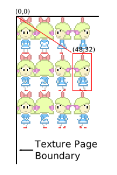

# Chapter 1.3: Textures, TPages and CLUTs

This tutorial will teach you how to draw graphics with textures, from
converting texture data to loading it onto VRAM, and finally drawing
said texture. This is yet another essential part in PS1 graphics
programming, as not having any textures would not always make for a
pretty looking game.

This chapter will also cover some development tools to be used for
preparing texture data, such as **timtool** and **img2tim**.

**Compatible with PSn00bSDK:** Yes

## Tutorial Index

- [Textures](#textures)
- [Color Look-up Tables(CLUT)](#color-look-up-tables-clut)
- [Texture Addressing on the PS1](#texture-addressing-on-the-ps1)
- [Defining and Selecting a Texture Page](#defining-and-selecting-a-texture-page)
- [Creating a TIM Texture Image](#creating-a-tim-texture-image)
- [Including TIM Image Data](#including-tim-image-data)
- [Tips, Tricks and Improvements](#tips-tricks-and-improvements)
- [Conclusion](#conclusion)

## Textures

A texture in the context of graphics programming, is basically a bitmap
of pixels that can either be drawn to the screen as a 2D image or mapped
onto polygons to add textures on 3D models.

On the PS1 hardware, textures are naturally stored in VRAM alongside the
display and drawing buffers described in previous tutorials. Textures
are generally positioned outside of said visual areas so to not get
overwritten by graphics frames drawn by the GPU. Once texture images
have been loaded, it can then be drawn by textured sprite and/or polygon
primitives.

The PS1 supports texture color depths of 4, 8 and 16 bits per pixel.
4-bit and 8-bit textures are usually accompanied with CLUT or Color
Lookup Table. A CLUT is essentially the color palette of its associated
texture image.

Because the VRAM addresses pixels in 16-bit words, 4-bit and 8-bit
textures are stored at quarter and half of the actual width of the
texture respectively as shown in the image below.

 
*4-bit, 8-bit and 16-bit texture images as they appear logically in VRAM*

This also means that 8-bit textures must have a width that is of a
multiple of 2 whilst 4-bit textures must be of a multiple of 4 to ensure
that the pixel data is word-aligned in VRAM. Failing to do so will often
yield artifacts, or corrupted texture images when trying to upload
odd-width images into VRAM.

Texture images are usually handled on the PS1 in the TIM file format,
which is a very simple image format designed specifically for the PS1 as
it can hold X and Y coordinates for either image and CLUT data which are
used as target coordinates when uploading the texture to VRAM. TIM files
are typically created from regular image files (bmp, pcx, jpeg or bmp)
with tools such as **timtool** included in the PsyQ/Programmer Tool SDK,
[img2tim](https://github.com/lameguy64/img2tim)
which is a free command-line driven TIM converter and finally,
[timedit](https://github.com/lameguy64/timedit)
which is essentially a free albeit slightly dodgy equivalent of
**timtool**.

For beginners it may be best to use **timedit** as its the only free
tool (or at the very least one that I\'m aware of) that features a
graphical preview of the TIM image layout in VRAM or stick to
**timtool** if you\'re using the PsyQ/Programmers Tool SDK.

## Color Look-up Tables (CLUT)

A CLUT is simply a 16x1 or 256x1 16-bit pixel image that normally
accompanies 4-bit and 8-bit texture images respectively. If you haven\'t
guessed by now, a CLUT is essentially the color palette of the image it
accompanies, where each pixel of the CLUT represents a 16-bit color
entry for the texture image starting from the left (ie. the first pixel
from the left represents the color for index 0 while the very last pixel
of the CLUT represents the color for index 15 or index 255). CLUTs are
normally used with 4-bit and 8-bit texture images, though it can also be
used for procedurally generated textures such as animated plasma
effects.

The TIM file format could support multiple CLUTs on a single TIM file,
as the CLUT headers in the file format allow for more than 1 pixel high
CLUTs. This is beyond the scope of this part of the tutorial series
however.

## Texture Addressing on the PS1

You may have learned from the last tutorial that the PS1 accesses the
VRAM as a two-dimensional image rather than a more conventional linear
framebuffer. Well, this also applies on how textures in VRAM are
\'selected\' for drawing with textured primitives.

The PS1 addresses the VRAM in pages, in which the VRAM is divided into a
grid of 16x2 cells of 64x256 16-bit pixels each. The actual texture page
coordinates are still X,Y but with a 64x256 granularity instead. The
image below visually illustrates the cells of each texture page.

 
*Texture page grid of the VRAM*

Texture pages only applies to the selection of the area at which
textures would be read from by textured graphics primitives, as VRAM
coordinates of display and drawing environments do not adhere to this
texture page granularity at all. Setting a texture page serves as an
anchor point at which textured primitives would source texture data from
starting from the top-left corner of the texture page, with the U,V
coordinates of the primitive serving as an offset relative to the
current texture page allowing small portions of a texture page to be
read and drawn, such as animation frames of one particular character in
a large sprite sheet.

 
*An example of using U,V coordinates to select a particular sprite
(in this case at 48,32) in a sprite sheet*

Of course this would mean that the texture images would have to be
arranged such that it is placed on the top-right corner of a texture
page boundary for the U,V coordinates to make the most sense. However,
some simple offset translation based on the texture image\'s position
relative to the page boundary should get around that issue and is going
to be covered in this chapter.

One thing to consider about texture coordinates that may initially
confuse beginners is that while the width of a 4-bit and 8-bit texture
on VRAM varies from the actual width of the image itself, the texture
coordinates does not need to be adjusted to take that into account as
long as the correct color depth is specified in the texture page value.
In this case, if you want to draw a texture at 96,24 from a 256x256
4-bit texture sheet, you just simply specify a U,V coordinate of 96,24
in your primitive as if the texture were still 16-bit.

 
*Texture coordinates are always true to the actual size of the texture
image*

And because the U,V coordinates only have a range of 0-255, it is not
possible to draw a texture image larger than 256x256 pixels regardless
of color depth. To draw larger textures one has to draw multiple
primitives to span the entire size of a larger image, trying to draw a
SPRT primitive with a size greater than 256x256 will only result in a
wrap around.

## Defining and Selecting a Texture Page

A texture page value is easily defined using the **getTPage()** macro. A
function version of this macro is present in the PsyQ/Programmers Tool
SDK as **GetTPage()**, but this is not available in PSn00bSDK as it
would be considered redundant.

    tpage = getTPage( tp, abr, x, y );

*tp* specifies the color depth for the texture page in the range of 0 to
2 (0:4-bit, 1:8-bit, 2:16-bit). *abr* specifies the blend operator for
both non-textured and textured semi-transparent primitives which can be
ignored for now and lastly, *x,y* specifies the X,Y coordinates of the
VRAM in 16-bit pixel units. Keep in mind that the coordinates will be
rounded down to the next lowest texture page.

Now that a texture page value has been defined, there are a number of
ways to set it to the GPU. One is through the *tpage* field of the
**DRAWENV** struct which specifies the initial texture page value
whenever the drawing environment is applied. Another is to use a
**DR\_TPAGE** primitive which can be defined with the **setDrawTPage()**
macro which follows the same syntax as **getTPage()**. **DR\_TPAGE** is
needed for **SPRT** primitives which lack a tpage field, though it is
also useful for non-textured primitives to set the blend operator for
semi-transparent primitives.

Because the PS1 usually processes primitives that have been sorted last
first, **DR\_TPAGE** primitives must be sorted after **SPRT** or other
similar primitives have been sorted.

The following table describes the bit fields of a texture page value
which may come in handy for the more crafty programmers.

| Bits | 15-14 | 13 | 12 | 11 | 10 | 9 | 8-7 | 6-5 | 4 | 3-0 |
|------|-------|----|----|----|----|---|-----|-----|---|-----|
| Description | Reserved | Y-flip\* | X-flip\* | Texture disable\* | Draw on displayed area | Dither enable | Texture color depth | Blend operator | Texture page Y (n\*256) | Texutre page X (n\*64) |

\*Does not work on *really* early units, not recommended to use to maintain compatibility

Whilst on the topic of texture page selection, when working with 4-bit
and 8-bit texture images you will also need to use **getClut()** to
define a CLUT value and is required for 4-bit and 8-bit texture images
to draw properly. Obviously this is not required for 16-bit texture
images.

    clut = getClut( x, y );

*x,y* specifies the X,Y coordinate of the CLUT within the VRAM. However,
keep in mind that the X axis must be a multiple to 16 pixels for a CLUT
to be defined correctly as otherwise it will be rounded down to the
lowest CLUT value.

As for selecting the CLUT, all textured primitives usually have a *clut*
field in the struct in which the CLUT value can be set to. There is also
a **setClut()** macro for setting CLUT coordinates to a primitive
directly.

Usually, the coordinates for texture page and CLUT values are typically
derived from the X,Y coordinates of the TIM image file to take into
account TIM images that are not placed on the top-left corner of the
texture page boundary.

The following describes the bit fields of a CLUT value.

| Bits | 15 | 14-6 | 5-0 |
|------|----|------|-----|
| Description | Reserved | Y coordinate | X coordinate (n\*16) |

## Creating a TIM Texture Image

There are numerous ways to convert image files into the TIM format, the
most common is by using **timtool** from the official PsyQ/Programmers
Tool SDKs, or at least those who chose to use that SDK. Another is to
use my free but old command-line converter called **img2tim**, which
follows the same command line syntax as **bmp2tim** but supports many
more image formats supported by the FreeImage library and has better
conversion options related to transparencies.

Perhaps the most preferable tool to use for those who\'ve stuck to using
PSn00bSDK is **timedit**, as not only is it free but also features a
similar graphical interface to **timtool**, on top of extra features
useful for managing a large amount of TIM images, such as grouping.

Whichever tool you use, convert the image below into a 8-bit TIM file
with image coordinates of 640,0 and CLUT coordinates of 0,480. You will
have to convert it into a 4-bit or 8-bit TIM as this tutorial is also
going to cover how to work with CLUTs.

When converting the image, always remember that texture image and CLUT
coordinates in the tools are always absolute coordinates to the VRAM
regardless of color depth. And in case you\'re wondering, the PS1 cannot
use 24-bit TIM images, as the GPU can only draw graphics in 16-bit color
depth but can display 24-bit images by entering 24-bit color mode, but
this is beyond the scope of this chapter.

## Including TIM Image Data

In the meantime, the easiest way to include a binary file into your
program is to include it as an object file by means of a very simple
assembler file, and access that file as an array by defining its symbol
name with extern. Its not ideal for larger projects, but this will do
the job for testing purposes.

### PsyQ/Programmers Tool SDK

Save the following as my\_image.asm.

        opt    m+,l.,c+

        section data            ; Store the array in the data section

        global tim_my_image     ; Define label as global
    tim_my_image:
        incbin 'my_image.tim'   ; Include file data (your TIM)

The name of the data is defined by the label, in this case
tim\_my\_image. Make sure the label is also defined by a global
directive so the linker can find it when linked against your C program.
When writing the assembler file, make sure line indentations are created
with real TAB characters as ASMPSX will throw an error otherwise.

Assemble the file using ASMPSX to turn it into an object file.

    asmpsx /l my_image.asm,my_image.obj

Then link it with your program by simply specifying the object file.

    ccpsx -O2 -Xm -Xo$80010000 my_image.obj program.c -o program.cpe

### PSn00bSDK

In PSn00bSDK, it works in much the same principle as in the PsyQ SDK,
but this one will be written in GNU assembler syntax. Save the assembler
file with a .s file extension.

    .section .data

    .global tim_my_image
    .type tim_my_image, @object
    tim_my_image:
        .incbin "my_image.tim"

It is recommended to use the makefile from one of the example programs
included with PSn00bSDK, as it has parameters for building with
assembler files already defined and should automatically pick your
assembler file as long as it has a .s file extension.

### Accessing the Array

On both SDKs, the binary file can be accessed as an array by simply
defining it with an extern. Make sure the name matches with the label
name defined in the assembler file.

    extern int tim_my_image[];

If you get mismatching type errors when compiling, you can simply cast
it with a different pointer type with (u\_long\*) or (u\_int\*)
depending on the compiler warnings you\'re getting. u\_int is typically
used in PSn00bSDK instead of u\_long as modern GCC interprets u\_long as
a 64-bit integer whereas it is a 32-bit integer in PsyQ.

## Parsing and Uploading the TIM to VRAM

To parse a TIM image file, use **OpenTIM()** to set the TIM file data
for parsing and **ReadTIM()** to retrieve header information of the TIM
file to a **TIM\_IMAGE** struct. The **TIM\_IMAGE** would contain not
only a pointer to the X,Y and size coordinates of either texture image
and CLUT but also pointers to the image and CLUT data within the TIM
file.

In PSn00bSDK, **GetTimInfo()** function instead. It still returns the
same **TIM\_IMAGE** struct.

The TIM image coordinates are in the *\*prect* field and CLUT in the
*\*crect* field, both are of type RECT. The actual texture image data is
at *\*paddr* and the CLUT data at *\*caddr*. The color depth of the TIM
file are in bits 0-3 of the *mode* field and CLUT presence is determined
by testing bit 4.

Uploading either pixel or CLUT data is done using **LoadImage()**,
followed by a call to **DrawSync()** to wait for texture upload to
complete. Whilst you might be able to get away with not waiting for the
texture upload to finish processing, it is recommended to wait for
upload completion as unpredictable results may occur otherwise.

The TIM image upload function should go like this.

    void LoadTexture(u_long *tim, TIM_IMAGE *tparam) {

        // Read TIM information (PsyQ)
        OpenTIM(tim);
        ReadTIM(tparam);

        // Read TIM information (PSn00bSDK)
        //GetTimInfo(tim, tparam);

        // Upload pixel data to framebuffer
        LoadImage(tparam->prect, (u_long*)tparam->paddr);
        DrawSync(0);

        // Upload CLUT to framebuffer if present
        if( tparam->mode & 0x8 ) {

            LoadImage(tparam->crect, (u_long*)tparam->caddr);
            DrawSync(0);

        }

    }

In PSn00bSDK, you may additionally replace u\_long to u\_int. They are
actually the same in PsyQ/Programmers Tool whereas in modern
GCC/PSn00bSDK u\_long usually defines a 64-bit unsigned integer.

Now that you have a TIM upload function, the TIM loading sequence should
go like so.

    extern int tim_my_image[];

    // To keep a copy of the TIM coordinates for later
    int tim_mode;
    RECT tim_prect,tim_crect;

    ..

    void LoadStuff(void) {

        // This can be defined locally, if you don't need the TIM coordinates
        TIM_IMAGE my_image;

        // Load the TIM
        LoadTexture((u_long*)tim_my_image, &my;_image);
        
        // Copy the TIM coordinates
        tim_prect   = *my_image.prect;
        tim_crect   = *my_image.crect;
        tim_mode    = my_image.mode;
        
    }

Reason you may want to keep a copy of the TIM coordinates separate from
the **TIM\_IMAGE** variable is that once you\'ve figured out how to load
files from CD and load the TIM file to a dynamically allocated buffer,
relying on the **TIM\_IMAGE** struct may not be a good idea as the
*\*prect* and *\*crect* fields point to the TIM file data directly, and
will most likely become undefined data once you\'ve finished uploading
that TIM to VRAM and deallocated its buffer in later parts of your
program.

## Drawing the TIM

Now that a texture image has been loaded. The next thing to do is to set
it\'s texture page to the drawing environment. Since there\'s only one
texture to deal with, the texture page can be set to the **DRAWENV**
struct.

    draw[0].tpage = getTPage( tim_mode&0x3, 0, tim_prect.x, tim_prect.y );
    draw[1].tpage = getTPage( tim_mode&0x3, 0, tim_prect.x, tim_prect.y );

To deal with TIMs that are not page aligned, the U,V offset relative to
the TIM\'s rounded down texture page can be determined with the
following and should work for texture images of any color depth.

    int tim_uoffs,tim_voffs;

    tim_uoffs = (tim_prect.x%64)<<(2-(tim_mode&0x3));
    tim_voffs = (tim_prect.y&0xff);

Whilst this would allow texture images to not require being aligned to
the top-left corner of the texture page boundary, texture images cannot
cross between the vertical texture page bounds and for 4-bit texture
images, should not cross the horizontal texture page bounds as otherwise
trying to draw the texture image with a **SPRT** will result in wrapping
in relation to the texture page.

Now to actually draw the texture image. This can be done with a **SPRT**
primitive which simply draws a textured sprite of a specified size. It
doesn\'t do fancy things such as rotation and scaling but its a useful
primitive for drawing simple sprites.

    SPRT *sprt;

    ...

    sprt = (SPRT*)nextpri;

    setSprt(sprt);              // Initialize the primitive (important)
    setXY0(sprt, 48, 48);       // Position the sprite at (48,48)
    setWH(sprt, 64, 64);        // Set sprite size to 64x64 pixels
    setUV0(sprt,                // Set UV coordinates from TIM offsets
        tim_uoffs, 
        tim_voffs);
    setClut(sprt,               // Set CLUT coordinates from TIM to sprite
        tim_crect.x,
        tim_crect.y);
    setRGB0(sprt,               // Set color of sprite, 128 is neutral
        128, 128, 128);

    addPrim(ot[db], sprt);      // Sort primitive to OT
    nextpri += sizeof(SPRT);    // Advance next primitive

When dealing with multiple texture images that tend to reside on
different texture pages, you will have to sort a **DR\_TPAGE** primitive
right after the **SPRT** primitive that requires a particular texture
page value set, as the PS1 processes primitives that are sorted last
first.

Whilst not required in this chapter, this is how you sort a
**DR\_TPAGE** for when you start playing around with more texture
images.

    DR_TPAGE *tpage;

    ...

    tpage = (DR_TPAGE*)nextpri;

    setDrawTPage(tpage, 0, 1,       // Set TPage primitive
        getTPage(my_image.mode&0x3, 0, 
        my_image.prect->x, my_image.prect->y));

    addPrim(ot[db], tpage);         // Sort primitive to OT

    nextpri += sizeof(DR_TPAGE);    // Advance next primitive address

A very simple optimization practice you may want to consider when you
start getting into larger projects is that you only need to sort one
**DR\_TPAGE** primitive if all the sprites sorted prior share a common
texture page.

## Sample Code

Working from code in the last tutorial, here\'s what the code should
look like:

    #include <sys/types.h>   // This provides typedefs needed by libgte.h and libgpu.h
    #include <stdio.h>    // Not necessary but include it anyway
    #include <libetc.h>   // Includes some functions that controls the display
    #include <libgte.h>   // GTE header, not really used but libgpu.h depends on it
    #include <libgpu.h>   // GPU library header

    #define OTLEN 8         // Ordering table length (recommended to set as a define
                            // so it can be changed easily)

    DISPENV disp[2];        // Display/drawing buffer parameters
    DRAWENV draw[2];
    int db = 0;

    // PSn00bSDK requires having all u_long types replaced with
    // u_int, as u_long in modern GCC that PSn00bSDK uses defines it as a 64-bit integer.

    u_long ot[2][OTLEN];    // Ordering table length
    char pribuff[2][32768]; // Primitive buffer
    char *nextpri;          // Next primitive pointer

    int tim_mode;           // TIM image parameters
    RECT tim_prect,tim_crect;
    int tim_uoffs,tim_voffs;

    void display() {
        
        DrawSync(0);                // Wait for any graphics processing to finish
        
        VSync(0);                   // Wait for vertical retrace

        PutDispEnv(&disp;[db]);      // Apply the DISPENV/DRAWENVs
        PutDrawEnv(&draw;[db]);

        SetDispMask(1);             // Enable the display

        DrawOTag(ot[db]+OTLEN-1);   // Draw the ordering table
        
        db = !db;                   // Swap buffers on every pass (alternates between 1 and 0)
        nextpri = pribuff[db];      // Reset next primitive pointer
        
    }

    // Texture upload function
    void LoadTexture(u_long *tim, TIM_IMAGE *tparam) {

        // Read TIM parameters (PsyQ)
        OpenTIM(tim);
        ReadTIM(tparam);

        // Read TIM parameters (PSn00bSDK)
        //GetTimInfo(tim, tparam);

        // Upload pixel data to framebuffer
        LoadImage(tparam->prect, (u_long*)tparam->paddr);
        DrawSync(0);

        // Upload CLUT to framebuffer if present
        if( tparam->mode & 0x8 ) {

            LoadImage(tparam->crect, (u_long*)tparam->caddr);
            DrawSync(0);

        }

    }

    void loadstuff(void) {

        TIM_IMAGE my_image;         // TIM image parameters

        extern u_long tim_my_image[];

        // Load the texture
        LoadTexture(tim_my_image, &my;_image);

        // Copy the TIM coordinates
        tim_prect   = *my_image.prect;
        tim_crect   = *my_image.crect;
        tim_mode    = my_image.mode;

        // Calculate U,V offset for TIMs that are not page aligned
        tim_uoffs = (tim_prect.x%64)<<(2-(tim_mode&0x3));
        tim_voffs = (tim_prect.y&0xff);

    }

    // To make main look tidy, init stuff has to be moved here
    void init(void) {
        
        // Reset graphics
        ResetGraph(0);

        // First buffer
        SetDefDispEnv(&disp;[0], 0, 0, 320, 240);
        SetDefDrawEnv(&draw;[0], 0, 240, 320, 240);
        // Second buffer
        SetDefDispEnv(&disp;[1], 0, 240, 320, 240);
        SetDefDrawEnv(&draw;[1], 0, 0, 320, 240);

        draw[0].isbg = 1;               // Enable clear
        setRGB0(&draw;[0], 63, 0, 127);  // Set clear color (dark purple)
        draw[1].isbg = 1;
        setRGB0(&draw;[1], 63, 0, 127);

        nextpri = pribuff[0];           // Set initial primitive pointer address
     
        // load textures and possibly other stuff
        loadstuff();

        // set tpage of lone texture as initial tpage
        draw[0].tpage = getTPage( tim_mode&0x3, 0, tim_prect.x, tim_prect.y );
        draw[1].tpage = getTPage( tim_mode&0x3, 0, tim_prect.x, tim_prect.y );

        // apply initial drawing environment
        PutDrawEnv(&draw;[!db]);
     
    }

    int main() {
        
        TILE *tile;                         // Pointer for TILE
        SPRT *sprt;                         // Pointer for SPRT

        // Init stuff
        init();
        
        while(1) {

            ClearOTagR(ot[db], OTLEN);      // Clear ordering table
        
            // Sort textured sprite
            
            sprt = (SPRT*)nextpri;

            setSprt(sprt);                  // Initialize the primitive (very important)
            setXY0(sprt, 48, 48);           // Position the sprite at (48,48)
            setWH(sprt, 64, 64);            // Set size to 64x64 pixels
            setUV0(sprt,                    // Set UV coordinates
                tim_uoffs, 
                tim_voffs);
            setClut(sprt,                   // Set CLUT coordinates to sprite
                tim_crect.x,
                tim_crect.y);
            setRGB0(sprt,                   // Set primitive color
                128, 128, 128);
            addPrim(ot[db], sprt);          // Sort primitive to OT

            nextpri += sizeof(SPRT);        // Advance next primitive address
            
            
            // Sort untextured tile primitive from the last tutorial
            
            tile = (TILE*)nextpri;          // Cast next primitive

            setTile(tile);                  // Initialize the primitive (very important)
            setXY0(tile, 32, 32);           // Set primitive (x,y) position
            setWH(tile, 64, 64);            // Set primitive size
            setRGB0(tile, 255, 255, 0);     // Set color yellow
            addPrim(ot[db], tile);          // Add primitive to the ordering table
            
            nextpri += sizeof(TILE);        // Advance the next primitive pointer
            
        
            // Update the display
            display();
            
        }
        
        return 0;
    }

Compile the example, run it and you should get a yellow square cascaded
by a sprite with your texture image.

You may notice that the untextured rectangle is drawn before the
textured sprite even though the textured sprite was sorted first and the
untextured rectangle last. That\'s because of the way how primitives are
appended to the ordering table in **addPrim()**, where the primitive
being sorted is linked right after a primitive that has been sorted to
it previously, and the PS1 hardware parses the ordering table from the
top of the array to the bottom with a reverse ordering table (created
with **ClearOTagR()**).

 
*How primitives are **appended** to a preoccupied ordering table entry*

Primitive 1 would be the **SPRT** primitive, Primitive 2 would be the
**DR\_TPAGE** primitive (if there was) and lastly, Primitive 3 would be
the untextured **TILE** primitive. You may think that a reverse order
ordering table makes no sense at first, but this technique is integral
to the PS1\'s ability to do on-the-fly sorting of polygons when
rendering 3D graphics.

## Tips, Tricks and Improvements

### Pre-calculate tpage, CLUT and UV offset in a struct

Using **getTPage()**, **getClut()** and **setClut()** macros on every
sprite sorted isn\'t exactly the most efficient way of doing things
especially when drawing lots of sprites, not to mention makes your code
look cluttered when managing several TIM images at once. This can be
addressed by defining a struct that contains all the parameters you need
precomputed for drawing a sprite.

    typedef struct _SPRITE {
        u_short tpage;  // Tpage value
        u_short clut;   // CLUT value
        u_char  u,v;    // UV offset (useful for non page aligned TIMs)
        u_char  w,h;    // Size (primitives can only draw 256x256 anyway)
        CVECTOR col;
    } SPRITE;

    ...

    // Sets parameters to a MYSPRITE using coordinates from TIM_INFO

    void GetSprite(TIM_IMAGE *tim, SPRITE *sprite) {

        // Get tpage value
        sprite->tpage = getTPage(tim->mode&0x3, 0, 
            tim->prect->x, tim->prect->y);
            
        // Get CLUT value
        if( tim->mode & 0x8 ) {
            sprite->clut = getClut(tim->crect->x, tim->crect->y);
        }
        
        // Set sprite size
        sprite->w = tim->prect->w<<(2-tim->mode&0x3);
        sprite->h = tim->prect->h;
        
        // Set UV offset
        sprite->u = (tim->prect->x&0x3f)<<(2-tim->mode&0x3);
        sprite->v = tim->prect->y&0xff;
        
        // Set neutral color
        sprite->col.r = 128;
        sprite->col.g = 128;
        sprite->col.b = 128;
        
    }

And to draw the sprite, you can write a simple function for it:

    char *SortSprite(int x, int y, u_long *ot, char *pri, SPRITE *sprite) {

        SPRT *sprt;
        DR_TPAGE *tpage;
        
        sprt = (SPRT*)pri;                  // initialize the sprite
        setSprt(sprt);

        setXY0(sprt, x, y);                 // Set position
        setWH(sprt, sprite->w, sprite->h);  // Set size
        setUV0(sprt, sprite->u, sprite->v); // Set UV coordinate of sprite
        setRGB0(sprt,                       // Set the color
            sprite->col.r, 
            sprite->col.g, 
            sprite->col.b);
        sprt->clut = sprite->clut;          // Set the CLUT value
        
        addPrim(ot, sprt);                  // Sort the primitive and advance
        pri += sizeof(SPRT);

        tpage = (DR_TPAGE*)pri;             // Sort the texture page value
        setDrawTPage(tpage, 0, 1, sprite->tpage);
        addPrim(ot, tpage);

        return pri+sizeof(DR_TPAGE);        // Return new primitive pointer
                                            // (set to nextpri)

    }

This method will also work for sprite sheets by simply modifying the
GetSprite() function mentioned earlier such that you can specify an U,V
offset relative to the TIM\'s U,V offset and the size of the sprite.

### Use Sprite Sheets

Instead of creating a single TIM image for each and every animation
frame of your character sprite, it is best to compile such small images
as one large image. This is called a sprite sheet and allows all sprite
frames to share a common palette if you use 4-bit or 8-bit color depth.
If all sprite frames have the same size, arrange the sprites in a grid
where each cell is the same size as the sprites. This way you can
compute the U,V coordinate of the sprites in the grid easily.

### Lower color depth textures are faster

A 4-bit texture is faster to draw than a 8-bit texture, and a 8-bit
texture is faster to draw than a 16-bit texture, as the GPU has to read
less data from VRAM when drawing textures of lower color depth. Find a
balance that achieves best possible performance without degrading the
quality of your sprites or texture images too much.

### SPRT\_8 and SPRT\_16 are faster than SPRT

The fixed size sprite primitives are a bit faster than **SPRT**
primitives, making them best suited for particle sprites of a fixed size
or when drawing tiles of a 2D map.

### Minimize tpage primitive changes

This technique is most applicable when drawing tile maps. If your tile
sheet fits in a single texture page (less than 256x256), you only have
to sort a single **DR\_TPAGE** primitive for all the tiles. This may
also help the GPU maintain texture cache coherency, as well as
minimizing redundant primitive packets.

### Textures don\'t need to be powers of two

Texutures of any size can be used by the GPU, though it is recommended
to make the width of 8-bit TIMs a multiples of 2 and multiples of 4 for
4-bit TIMs as mentioned earlier in this chapter.

## Conclusion

This concludes Chapter 1.3. of Lameguy64\'s PSX Tutorial series. If
you\'ve sifted though this chapter well enough, you should have figured
out how to handle TIM images, uploading them to VRAM and drawing them.

A few things you may want to experiment with for further learning:

-   Try loading more TIMs and drawing them as individual sprites. Make
    sure the TIM image and CLUT do not overlap one another in the TIM
    editing tool you\'re using.

---

[Previous](chapter_1_2.md)  |  [Back to Index](index.md)  |  [Next](chapter_1_4.md)

---
