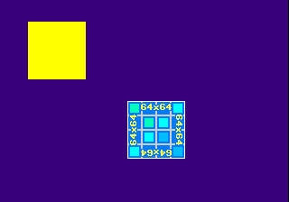

# Chapter 1.4: Controllers

One of the most important aspects when writing software for a game
console is taking input from a controller, as otherwise what\'s the
point of a game where the player can\'t take control of it? Unless its
some demoscene stuff you intend to write for the console.

This chapter goes over how to initialize and handle controller input in
your PS1 program. This is something that hasn\'t really been explained
very well in many tutorials that I\'ve seen in my personal experience,
so I\'ll try my best to explain how controller input is handled on the
PS1 in great detail.

**Compatible with PSn00bSDK:** Yes

## Tutorial Index

- [Methods to Obtain Controller Input](#methods-to-obtain-controller-input)
- [Initializing the Pad Subsystem](#initializing-the-pad-subsystem)
- [Parsing Controller Data](#parsing-controller-data)
- [Implementation](#implementation)
- [Conclusion](#conclusion)

## Methods to Obtain Controller Input

There are a number of ways to obtain input from the controller on the
PS1; direct hardware access (complicated), through BIOS
**InitPAD()/StartPAD()** (simpler, but has some limitations), though
**PadInit()/PadRead()** (even simpler, but only works with digital
pads), and through various controller related libraries such as libtap,
libgun and libpad provided in the PsyQ/Programmers\' Tool SDK.

The most common method people tend to use is **PadInit()** and
**PadRead()**, and whilst it is the most simplest to use it is not
exactly the most ideal method for a proper game project. For one it only
works with digital pads and Dual-shock pads with analog turned off.
Secondly, there\'s no way to determine if a pad is disconnected or not
and rumble features on Dual-shock pads cannot be accessed with it. It
is, however, ideal for prototype test programs.

Another method which is a little more ideal is to use **InitPAD()** and
**StartPAD()** which are provided by the BIOS ROM of the console. This
method is not only capable of determining if a controller is attached or
not but it also works with a wider variety of controllers including
multi-taps. The only controllers that it doesn\'t really support
properly are both the Namco and Konami lightguns as they need to be
polled in a specific way for it to work, which is not supported by these
functions. Lightguns are beyond the scope for this chapter anyway. It
still cannot access rumble features of Dual-analog and Dual-shock
controllers however.

For compatibility with PSn00bSDK, only the BIOS **InitPAD()** and
**StartPAD()** functions will be covered in this chapter. In the future,
I will look into making a follow-up that uses libpad or a similar
equivalent library for PSn00bSDK that would also cover accessing rumble
features of Dual-analog and Dual-shock pads.

## Initializing the Pad Subsystem

The first step is to define an array of two 34 byte elements. This array
will be used as a buffer for storing incoming controller data which
requires at least about 34 bytes per controller port. It may sound a bit
excessive for storing input data, but this is necessary in case a
multitap is connected to one of the ports, as a multitap will return up
to 34 bytes from all four controllers connected to the tap.

    u_char padbuff[2][34];

Next is to call **InitPAD()** to define the pad array to the BIOS
controller subsystem. libpad still uses the same buffer format that
**InitPAD()** would return data to, so upgrading from the BIOS pad
routines to libpad should be pretty trivial.

    InitPAD( padbuff[0], 34, padbuff[1], 34 );

Before you start controller polling, it may be a good idea to set the
first two elements of both arrays with 0xff, so that your program won\'t
process faulty input when the array is parsed with zero filled data.
You\'ll figure out why later in this chapter.

    padbuff[0][0] = padbuff[0][1] = 0xff;
    padbuff[1][0] = padbuff[1][1] = 0xff;

Then start controller polling with **StartPAD()**.

    StartPAD();

After calling **StartPAD()** and you have a tty console in your
development setup (or the message window in no\$psx), you may see the
message *\"VSync: Timeout\"* pop-up when your program reaches a
**VSync** call. This happens because **StartPAD()** annoyingly
re-enables automatic VSync interrupt acknowledge in the PS1\'s kernel,
preventing the **VSync()** function from detecting a VSync interrupt
from occuring. Fortunately, it has a timeout, of which it will disable
the automatic VSync acknowledge so it can detect VSync interrupts again.
This can happen on both Programmer\'s Tool and PSn00bSDK.

In PSn00bSDK, you can avoid this message by calling
**ChangeClearPAD(1)** after **StartPAD()**, but this function is only
really exposed in PSn00bSDK.

It is generally unnecessary to stop controller polling using
**StopPAD()**, plus it may cause Dual-shock controllers to reset their
controller mode back to digital mode. If you\'re using BIOS memory card
functions later down the line, stopping pads will also stop memory cards
as well. Using **StopPAD()** is only really required when transferring
execution to a child PS-EXE or another PS-EXE altogether.

## Parsing Controller Data

After calling **StartPAD()**, the padbuff array will be filled with
controller data in every frame. For NTSC systems this is 60 times a
second and 50 for PAL systems. Therefore, the controller ports are
polled automatically, so the only thing to do next is to parse the input
data stored in the arrays.

Because the PS1\'s BIOS controller handler depends on VSync interrupts
to poll the controller ports, you will not be able to receive further
inputs when interrupts are disabled, but this isn\'t really something to
worry about yet at this point in this tutorial series.

Now, onto the pad buffer data. The first byte stored in the padbuff
array denotes the status of the port. A value of zero indicates that a
device (ie. controller) is connected to the port and the rest of the
array contains valid controller data.

    if( padbuff[0][0] == 0 )
    {
        // controller on port 1 connected
    }

The following byte is the controller ID, denoting both the controller
type and the number of bytes the controller has sent to the console. The
controller type is stored in the upper 4 bits of the ID byte while the
data byte is at the lower 4 bits.

    padtype = padbuff[0][1]>>4;    // get the controller type
    padlen  = padbuff[0][1]&0xF;   // get the data length (normally not needed)

The following table lists controller type values that are relevant to
this chapter. Lightgun IDs are omitted as you won\'t be able to poll
them properly anyway.

| Controller | Type Value |
|------------|------------|
| Mouse                                                | 0x1 |
| Namco NegCon                                         | 0x2 |
| Digital pad or Dual-shock in digital mode (no light) | 0x4 |
| Analog Stick or Dual-analog in green mode            | 0x5 |
| Dual-shock in analog mode or Dual-analog in red mode | 0x7 |
| Namco JogCon                                         | 0xE |

The two bytes following the ID byte are usually the controller\'s
digital button states as a 16-bit integer, with each bit representing
the state of one button. Oddly, the bit states are inverted, where a bit
value of 1 means released and a value of 0 means pressed.

The following table lists which bit of the 16-bit word corresponds to
each button of a standard digital pad or Dual-shock controller. Both
controllers share the same bit positions.

| Bit | Button |
|-----|--------|
| 0   | Select |
| 1   | L3 (Dual-shock only) |
| 2   | R3 (Dual-shock only) |
| 3   | Start |
| 4   | Up |
| 5   | Right |
| 6   | Down |
| 7   | Left |
| 8   | L2 |
| 9   | R2 |
| 10  | L1 |
| 11  | R1 |
| 12  | Triangle |
| 13  | Circle |
| 14  | Cross |
| 15  | Square |

It may be a good idea to define a list of constants for each button so
you can specify which bit to test with more coherent names. In
PSn00bSDK, these are already defined in psxpad.h.

    #define PAD_SELECT      1
    #define PAD_L3          2
    #define PAD_R3          4
    #define PAD_START       8
    #define PAD_UP          16
    #define PAD_RIGHT       32
    #define PAD_DOWN        64
    #define PAD_LEFT        128
    #define PAD_L2          256
    #define PAD_R2          512
    #define PAD_L1          1024
    #define PAD_R1          2048
    #define PAD_TRIANGLE    4096
    #define PAD_CIRCLE      8192
    #define PAD_CROSS       16384
    #define PAD_SQUARE      32768

To test if a button is pressed, simply mask the 16-bit integer against
the bit value of the button you want to test using an AND (&) operator.
Because the pressed state of a button is zero, you\'ll have to follow it
up with a NOT (!) operator as well.

    u_short button;

    ...

    button = *((u_short*)(padbuff[0]+2));

    // is cross pressed?
    if( !( button & PAD_CROSS ) )
    {
        // do something when cross is pressed
    }

If you only need to support regular controllers (digital, analog stick,
Dual-analog, Dual-shock), a simplle struct like this should suffice for
all the four controller types and with analog input on controllers with
such features. In PSn00bSDK, the following struct is already defined in
psxpad.h.

    typedef struct _PADTYPE
    {
        unsigned char   stat;
        unsigned char   len:4;
        unsigned char   type:4;
        unsigned short  btn;
        unsigned char   rs_x,rs_y;
        unsigned char   ls_x,ls_y;
    } PADTYPE;

If the connected controller doesn\'t feature any analog inputs, the
elements following btn relating to analog sticks can be ignored.

When parsing analog stick inputs, remember that the coordinates when the
stick is at its center position is not always 128, due to deadzones and
other factors that affect the potentiometers. Its recommended to
implement a simple threshold to make sure your code does not register
false inputs (at least to the player) when the stick is placed at its
center position.

For more information about controller input data, you may want to check
the [Controllers Chapter](http://problemkaputt.de/psx-spx.htm#controllersstandarddigitalanalogcontrollers)
in nocash\'s PSX specs document.

## Implementation

As an exercise for this chapter, we\'re going to make the textured
sprite from the last chapter move using the controller. Begin by adding
the button definitions, structs and padbuff array described in this
chapter near the beginning of the source file, but must be placed
**after** the \#include directives. When using PSn00bSDK, you can simply
include psxpad.h instead, which already has those defined.

Next, place the **InitPAD()** and **StartPAD()** calls at the end of
your **init()** function, so pads get initialized alongside the
graphics. If you\'re using PSn00bSDK, you can add **ChangeClearPAD(1)**
after **StartPAD()** to avoid the VSync: Timeout message from cropping
up in your tty terminal.

Next, define two variables named *pos\_x* and *pos\_y* of type **int**
at the start of the **main()** function, preferably before the line that
defines the **TILE** variable. These will be for storing the X,Y
coordinates for the textured sprite. Following that, define a variable
*pad* of type **PADTYPE**, this will be used for reading controller
inputs more easily.

Before the while loop, set both *pos\_x* and *pos\_y* to 48 to make sure
they don\'t contain a random undefined value. Within the loop, add the
following code that parses the controller and performs actions according
to controller inputs.

    pad = (PADTYPE*)padbuff[0];

    // Only parse inputs when a controller is connected
    if( pad->stat == 0 )
    {
        // Only parse when a digital pad, 
        // dual-analog and dual-shock is connected
        if( ( pad->type == 0x4 ) || 
            ( pad->type == 0x5 ) || 
            ( pad->type == 0x7 ) )
        {
            if( !(pad->btn&PAD;_UP) )            // test UP
            {
                pos_y--;
            }
            else if( !(pad->btn&PAD;_UP) )       // test DOWN
            {
                pos_y++;
            }
            if( !(pad->btn&PAD;_LEFT) )          // test LEFT
            {
                pos_x--;
            }
            else if( !(pad->btn&PAD;_RIGHT) )    // test RIGHT
            {
                pos_x++;
            }
        }
    }

Now, go to the bit of code that sorts the textured sprite, and modify
the **setXY0** macro call to use X,Y coordinates from *pos\_x* and
*pos\_y*.

    setXY0(sprt, pos_x, pos_y);

If you followed the instructions properly, the source code should look
like this:

    #include <sys/types.h>   // This provides typedefs needed by libgte.h and libgpu.h
    #include <stdio.h>    // Not necessary but include it anyway
    #include <libetc.h>   // Includes some functions that controls the display
    #include <libgte.h>   // GTE header, not really used but libgpu.h depends on it
    #include <libgpu.h>   // GPU library header
    #include <libapi.h>     // API header, has InitPAD() and StartPAD() defs

    #define OTLEN 8         // Ordering table length (recommended to set as a define
                            // so it can be changed easily)

    DISPENV disp[2];        // Display/drawing buffer parameters
    DRAWENV draw[2];
    int db = 0;

    // PSn00bSDK requires having all u_long types replaced with
    // u_int, as u_long in modern GCC that PSn00bSDK uses defines it as a 64-bit integer.

    u_long ot[2][OTLEN];    // Ordering table length
    char pribuff[2][32768]; // Primitive buffer
    char *nextpri;          // Next primitive pointer

    int tim_mode;           // TIM image parameters
    RECT tim_prect,tim_crect;
    int tim_uoffs,tim_voffs;

    // Pad stuff (omit when using PSn00bSDK)
    #define PAD_SELECT      1
    #define PAD_L3          2
    #define PAD_R3          4
    #define PAD_START       8
    #define PAD_UP          16
    #define PAD_RIGHT       32
    #define PAD_DOWN        64
    #define PAD_LEFT        128
    #define PAD_L2          256
    #define PAD_R2          512
    #define PAD_L1          1024
    #define PAD_R1          2048
    #define PAD_TRIANGLE    4096
    #define PAD_CIRCLE      8192
    #define PAD_CROSS       16384
    #define PAD_SQUARE      32768

    typedef struct _PADTYPE
    {
        unsigned char   stat;
        unsigned char   len:4;
        unsigned char   type:4;
        unsigned short  btn;
        unsigned char   rs_x,rs_y;
        unsigned char   ls_x,ls_y;
    } PADTYPE;

    // pad buffer arrays
    u_char padbuff[2][34];

    void display() {
        
        DrawSync(0);                // Wait for any graphics processing to finish
        
        VSync(0);                   // Wait for vertical retrace

        PutDispEnv(&disp;[db]);      // Apply the DISPENV/DRAWENVs
        PutDrawEnv(&draw;[db]);

        SetDispMask(1);             // Enable the display

        DrawOTag(ot[db]+OTLEN-1);   // Draw the ordering table
        
        db = !db;                   // Swap buffers on every pass (alternates between 1 and 0)
        nextpri = pribuff[db];      // Reset next primitive pointer
        
    }

    // Texture upload function
    void LoadTexture(u_long *tim, TIM_IMAGE *tparam) {

        // Read TIM parameters (PsyQ)
        OpenTIM(tim);
        ReadTIM(tparam);

        // Read TIM parameters (PSn00bSDK)
        //GetTimInfo(tim, tparam);

        // Upload pixel data to framebuffer
        LoadImage(tparam->prect, (u_long*)tparam->paddr);
        DrawSync(0);

        // Upload CLUT to framebuffer if present
        if( tparam->mode & 0x8 ) {

            LoadImage(tparam->crect, (u_long*)tparam->caddr);
            DrawSync(0);

        }

    }

    void loadstuff(void) {

        TIM_IMAGE my_image;         // TIM image parameters

        extern u_long tim_my_image[];

        // Load the texture
        LoadTexture(tim_my_image, &my;_image);

        // Copy the TIM coordinates
        tim_prect   = *my_image.prect;
        tim_crect   = *my_image.crect;
        tim_mode    = my_image.mode;

        // Calculate U,V offset for TIMs that are not page aligned
        tim_uoffs = (tim_prect.x%64)<<(2-(tim_mode&0x3));
        tim_voffs = (tim_prect.y&0xff);

    }

    // To make main look tidy, init stuff has to be moved here
    void init(void) {
        
        // Reset graphics
        ResetGraph(0);

        // First buffer
        SetDefDispEnv(&disp;[0], 0, 0, 320, 240);
        SetDefDrawEnv(&draw;[0], 0, 240, 320, 240);
        // Second buffer
        SetDefDispEnv(&disp;[1], 0, 240, 320, 240);
        SetDefDrawEnv(&draw;[1], 0, 0, 320, 240);

        draw[0].isbg = 1;               // Enable clear
        setRGB0(&draw;[0], 63, 0, 127);  // Set clear color (dark purple)
        draw[1].isbg = 1;
        setRGB0(&draw;[1], 63, 0, 127);

        nextpri = pribuff[0];           // Set initial primitive pointer address
     
        // load textures and possibly other stuff
        loadstuff();

        // set tpage of lone texture as initial tpage
        draw[0].tpage = getTPage( tim_mode&0x3, 0, tim_prect.x, tim_prect.y );
        draw[1].tpage = getTPage( tim_mode&0x3, 0, tim_prect.x, tim_prect.y );

        // apply initial drawing environment
        PutDrawEnv(&draw;[!db]);
        
        // Initialize the pads
        InitPAD( padbuff[0], 34, padbuff[1], 34 );
        
        // Begin polling
        StartPAD();
        
        // To avoid VSync Timeout error, may not be defined in PsyQ
        ChangeClearPAD( 1 );
     
    }

    int main() {
        
        int pos_x,pos_y;
        PADTYPE *pad;
        
        TILE *tile;                         // Pointer for TILE
        SPRT *sprt;                         // Pointer for SPRT

        // Init stuff
        init();
        
        pos_x = pos_y = 48;
        
        while(1) {
        
            // Parse controller input
            pad = (PADTYPE*)padbuff[0];

            // Only parse inputs when a controller is connected
            if( pad->stat == 0 )
            {
                // Only parse when a digital pad, 
                // dual-analog and dual-shock is connected
                if( ( pad->type == 0x4 ) || 
                    ( pad->type == 0x5 ) || 
                    ( pad->type == 0x7 ) )
                {
                    if( !(pad->btn&PAD;_UP) )            // test UP
                    {
                        pos_y--;
                    }
                    else if( !(pad->btn&PAD;_DOWN) )       // test DOWN
                    {
                        pos_y++;
                    }
                    if( !(pad->btn&PAD;_LEFT) )          // test LEFT
                    {
                        pos_x--;
                    }
                    else if( !(pad->btn&PAD;_RIGHT) )    // test RIGHT
                    {
                        pos_x++;
                    }
                }
            }

            ClearOTagR(ot[db], OTLEN);      // Clear ordering table
        
            // Sort textured sprite
            
            sprt = (SPRT*)nextpri;

            setSprt(sprt);                  // Initialize the primitive (very important)
            setXY0(sprt, pos_x, pos_y);           // Position the sprite at (48,48)
            setWH(sprt, 64, 64);            // Set size to 64x64 pixels
            setUV0(sprt,                    // Set UV coordinates
                tim_uoffs, 
                tim_voffs);
            setClut(sprt,                   // Set CLUT coordinates to sprite
                tim_crect.x,
                tim_crect.y);
            setRGB0(sprt,                   // Set primitive color
                128, 128, 128);
            addPrim(ot[db], sprt);          // Sort primitive to OT

            nextpri += sizeof(SPRT);        // Advance next primitive address
            
            
            // Sort untextured tile primitive from the last tutorial
            
            tile = (TILE*)nextpri;          // Cast next primitive

            setTile(tile);                  // Initialize the primitive (very important)
            setXY0(tile, 32, 32);           // Set primitive (x,y) position
            setWH(tile, 64, 64);            // Set primitive size
            setRGB0(tile, 255, 255, 0);     // Set color yellow
            addPrim(ot[db], tile);          // Add primitive to the ordering table
            
            nextpri += sizeof(TILE);        // Advance the next primitive pointer
            
        
            // Update the display
            display();
            
        }
        
        return 0;
    }

Compile, execute and you should get a textured sprite that you can move
around with the directional pad of the controller.

## Conclusion

Hopefully, this chapter should teach you about getting controller input
more than using **PadInit()** and **PadStart()**. The only downside with
this method is that you can\'t control the vibration motors of either
Dual-analog or Dual-shock controllers, or enabling analog mode on
Dual-shock controllers in software. Hopefully, this will be covered in a
future chapter of this tutorial series.

In the next chapter, we\'ll be looking into handling analog inputs and a
glimpse of fixed-point integer math for performing fractional
calculations without using floats.

---

[Previous](chapter_1_3.md)  |  [Back to Index](index.md)  |  [Next](chapter_1_5.md)

---
