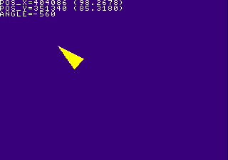
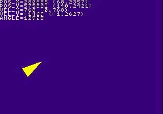
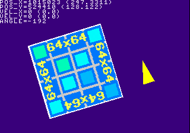

# Chapter 1.5: Fixed Point Math

If you\'ve been trying to write some games on a modern system (ie. your
PC), you probably already know about using floats to implement momentum
and jumping physics in a 2D platformer, or have something move towards a
direction specified in degrees rather than X,Y velocity values to have
said object move at an angle, like a ship in an Asteroids style game or
a car in a top-down racer\... On the PlayStation, these principles still
apply. But there\'s a problem; the PlayStation does not have a hardware
floating point unit.

Whilst you can still use floats on the PlayStation as the compiler will
resort to software emulation to perform such operations, which you might
be able to get away with, it\'s not exactly the most ideal method as
software emulation of floats is quite slow, and will become an issue if
used for collision detection or processing movement of a hundred
projectile entities\... The alternative that\'s better suited for a
system without a floating point unit is to use a integer based
fractional number system commonly known as fixed point math.

As the name suggests, fixed point math is a trick for storing fractional
numbers with fixed points, in this case an integer scale of 4096 will
have a range between zero to 4095 representing a fractional value, with
4096 representing a integer value of 1. Fixed point math is used heavily
in games made for systems that lacked a floating point unit (5th
generation and older consoles), or where integer math is considerably
faster than floating point math and not all systems feature a floating
point unit (ie. IBM compatible PCs).

This chapter covers the general idea and basics of performing fixed
point integer arithmetic. This is a highly essential chapter when
getting into PlayStation homebrew development, as learning it will
increase the range of games you can write for the console immensely. If
you\'ve already learned some binary encoding of numeric values this
chapter might be a bit easier to understand.

**Compatible with PSn00bSDK:** Yes

## Tutorial Index

- [Principle of Fixed Point Math](#principle-of-fixed-point-math)
- [Fixed Point Arithmetic Basics](#fixed-point-arithmetic-basics)
- [Implementing Tank Controls with Fixed Point](#implementing-tank-controls-with-fixed-point)
- [Asteroids Style Physics with Fixed Point](#asteroids-style-physics-with-fixed-point)
- [Bonus: Fixed Point Sprite Rotation](#bonus-fixed-point-sprite-rotation)
- [Limitations of Fixed Point Math](#limitations-of-fixed-point-math)
- [Conclusion and Further Reading](#conclusion-and-further-reading)

## Principle of Fixed Point Math

The basic principle of fixed point integer math is instead of
representing a real number of 1.25 as a floating point number, you
instead represent the number as an integer value from a scale value, in
this case 4096 which is defined as **ONE** in the GTE library headers.
So a real value of 1.25 will look like 5120 when converted to fixed
point math with a scale of 4096. Converting a floating point number to a
fixed point number is achieved by simply multiplying the real number
against the scale value and rounding off the fractions, turning the
result into a plain integer value. The following table shows some sample
floating point values represented in fixed point.

| Floating point representation | Fixed point representation |
|-------------------------------|----------------------------|
| 1.25 | 5120 |
| 0.75 | 3072 |
| 0.2  | 819  |
| 21.284 | 87179 |
| 1.0 | 4096 |

Using a scale value of 4096 is most ideal for PlayStation projects not
only because it provides a good balance between precision and the
maximum decimal value it can store, alongside allowing fixed point
values to be rounded and divided quickly with simple bit shift
operations and AND masks, but also because the Geometry Transformation
Engine (GTE) also uses the same scale value for some of its registers.
Any scale value can be used to gain more precision or to increase the
decimal range limit. Generally a power of two scale value is recommended
for performance reasons.

| Bits | 31 | 30 - 12 | 11 - 0 |
|------|----|---------|--------|
| Description | Sign | Decimal (19 bits) | Fractional (12 bits) |

The table above illustrates a fixed point value with a scale value of
4096 in a signed 32-bit integer. As there\'s only 19 bits available for
the decimal portion the maximum range for the decimal value is -524288
to 524287.

## Fixed Point Arithmetic Basics

Simple mathematical operations in fixed point such as addition and
subtraction is not that much different to performing the same operations
with integers, only values have to be based around the scale value.

    fixed_value += 4096;    // += 1.0
    fixed_value -= 4096;    // -= 1.0
    fixed_value += 2048;    // += 0.5
    fixed_value -= 6144;    // -= 1.5

For decimal multiplication and divide operations, the value for the
dividend or multiplicand stays as-is.

    fixed_value *= 5;       // *= 5;
    fixed_value /= 10;      // /= 10;

The equation for performing fractional multiplications is a little
tricky, but still not too complicated.

    multiplicand    = 2048;                             // multiplicand = 0.5;
    fixed_value     = (fixed_value*multiplicand)>>12;   // fixed_value *= multiplicand;

    multiplicand    = 6144;                             // multiplicand = 1.5;
    fixed_value     = (fixed_value*multiplicand)>>12;   // fixed_value *= multiplicand;

For fractional divisions, the value will need to be multiplied by the
scale value and then divided by the dividend. Keep in mind that division
by zero would still occur if the dividend is zero.

    dividend        = 2048;                             // dividend = 0.5;
    fixed_value     = (fixed_value*4096)/dividend;      // fixed_value /= dividend;

    dividend        = 6144;                             // dividend = 1.5;
    fixed_value     = (fixed_value*4096)/dividend;      // fixed_value /= dividend;

## Implementing Tank Controls with Fixed Point

As a little exercise, this part of the chapter will go through using
fixed point math to implement tank controls. The basic jist of this is
that instead of moving the player position directly by which direction
of the D-pad is pressed, instead, left and right will adjust the angle
the player is facing while up and down moves the player forward and
backward perpendicular to where the player is facing. To do this
requires using sine and cosine values and conveniently, the GTE
libraries of both SDKs feature integer based sine and cosine functions
which is exactly what\'s needed for this exercise.

In the official PsyQ or Programmer\'s Tool SDKs there are two integer
based sine and cosine functions which are **rsin()**/**rcos()** and
**csin()**/**ccos()**. The differences between the two is that
**rsin()**/**rcos()** takes up less code but is slower, whereas
**csin()**/**ccos()** takes up more code but is faster. PSn00bSDK on the
other hand only has one set of functions called **isin()/icos()**, which
are based on a Taylor series implementation which is both small and
fast. PSn00bSDK provides definitions for **rsin()**/**rcos()** and
**csin()**/**ccos()** that simply points to **isin()/icos()** for
compatibility with PsyQ / Programmer\'s Tool projects and sample code.

These functions also take degrees in a fixed point range of 0 to 4096
where 4096 equals to 360 degrees, so a value of 45 degrees will be
specified as 512. The value returned is also in a fixed point notation
with a scale of 4096, where 4096 equals to 1.0.

Working from code from the controllers chapter, rewrite the code that
defines the initial values of the player position to begin at the center
of the screen. Because the player coordinates will be in fixed point,
the screen center coordinate must be multiplied by **ONE**.

    pos_x = ONE*(disp[0].disp.w>>1);
    pos_y = ONE*(disp[0].disp.h>>1);

Then, define a new variable for the player\'s angle and set the initial
value to zero.

    int angle;

    angle = 0;

The player will be represented as a rotating triangle in this chaper, so
a simple array of vector coordinates will define the shape of the
triangle. The triangle will be rotated with, you guessed it, fixed point
math as well.

    SVECTOR player_tri[] =
    {
        {   0, -20,  0  },
        {  10,  20,  0  },
        { -10,  20,  0  }
    };

Then ditch the code for sorting **TILE** and **SPRT** primitives and
replace it with the following routine that sorts a rotating triangle.

    POLY_F3 *tri;

    ...

    // Rotate the triangle coordinates based on the player's angle
    // as well as apply the position
    for( i=0; i<3; i++ )
    {
        v[i].vx = (((player_tri[i].vx*ccos( angle ))
            -(player_tri[i].vy*csin( angle )))>>12)+(pos_x>>12);
        v[i].vy = (((player_tri[i].vy*ccos( angle ))
            +(player_tri[i].vx*csin( angle )))>>12)+(pos_y>>12);
    }

    // Sort the player triangle
    tri = (POLY_F3*)nextpri;
    setPolyF3( tri );
    setRGB0( tri, 255, 255, 0 );
    setXY3( tri,
        v[0].vx, v[0].vy,
        v[1].vx, v[1].vy,
        v[2].vx, v[2].vy );
        
    addPrim( ot[db], tri );
    nextpri += sizeof(POLY_F3);

And then replace the input code with the following. If you\'ve written
something that played like Asteroids in the past, this may look pretty
familiar.

    if( !(pad->btn&PAD;_UP) )            // test UP
    {
        pos_x += csin( angle );
        pos_y -= ccos( angle );
    }
    else if( !(pad->btn&PAD;_DOWN) )     // test DOWN
    {
        pos_x -= csin( angle );
        pos_y += ccos( angle );
    }
    if( !(pad->btn&PAD;_LEFT) )          // test LEFT
    {
        // Turns counter-clockwise
        angle -= 16;
    }
    else if( !(pad->btn&PAD;_RIGHT) )    // test RIGHT
    {
        // Turns clockwise
        angle += 16;
    }

Next is to finally add some text drawing so the player coordinates can
be displayed on screen, so you can see how fixed point numbers work
while interacting with the sample program more easily. This can be done
with the debug font functions provided by libetc or psxetc in both PsyQ
/ Programmer\'s Tool and PSn00bSDK respectively. These font functions
are intended for debugging purposes, so they\'re not fit for drawing
things like player status with custom fonts and lower case letters.

Start by loading the debug font texture to VRAM using **FntLoad()**,
then, initialize a font window using **FntOpen()**. Ideally, you should
put these calls inside the **init()** function.

    // Load the font texture on the upper-right corner of the VRAM
    FntLoad( 960, 0 );

    // Define a font window of 100 characters covering the whole screen
    FntOpen( 0, 8, 320, 224, 0, 100 );

Text can be printed using **FntPrint()** which works more or less like
**printf()**, only text output is directed to the specified font window.
The first argument specifies which font window the text should go to,
the value of which is obtained through the return value of
**FntOpen()**. Specifying -1 directs text to the last opened font
window. The debug font routines can only draw uppercase text, and text
color and font cannot be customized.

In PsyQ / Programmers tool the first argument can be omitted, but modern
GNU GCC does not support this convention anymore.

    // Print player coordinates
    FntPrint( -1, "POS_X=%d (%d.%d)\n", pos_x, (pos_x>>12), (pos_x&0xfff) );
    FntPrint( -1, "POS_Y=%d (%d.%d)\n", pos_y, (pos_y>>12), (pos_y&0xfff) );
    FntPrint( -1, "ANGLE=%d\n", angle );

Then to make the text actually appear, call **FntFlush()** to draw the
characters \'printed\' by **FntPrint()** and flush the character buffer.
This should be called immediately before the **display()** call in the
sample code.

    // Draw and flush the character buffer
    FntFlush( -1 );

The finished code should look like the following (the texture stuff
remains for future samples):

    #include <sys/types.h>   // This provides typedefs needed by libgte.h and libgpu.h
    #include <stdio.h>    // Not necessary but include it anyway
    #include <psxetc.h>   // Includes some functions that controls the display
    #include <psxgte.h>   // GTE header, not really used but libgpu.h depends on it
    #include <psxgpu.h>   // GPU library header
    #include <psxapi.h>

    #define OTLEN 8         // Ordering table length (recommended to set as a define
                            // so it can be changed easily)

    DISPENV disp[2];        // Display/drawing buffer parameters
    DRAWENV draw[2];
    int db = 0;

    // PSn00bSDK requires having all u_long types replaced with
    // u_int, as u_long in modern GCC that PSn00bSDK uses defines it as a 64-bit integer.

    u_int ot[2][OTLEN];    // Ordering table length
    char pribuff[2][32768]; // Primitive buffer
    char *nextpri;          // Next primitive pointer

    int tim_mode;           // TIM image parameters
    RECT tim_prect,tim_crect;
    int tim_uoffs,tim_voffs;

    // Pad stuff
    #define PAD_SELECT      1
    #define PAD_L3          2
    #define PAD_R3          4
    #define PAD_START       8
    #define PAD_UP          16
    #define PAD_RIGHT       32
    #define PAD_DOWN        64
    #define PAD_LEFT        128
    #define PAD_L2          256
    #define PAD_R2          512
    #define PAD_L1          1024
    #define PAD_R1          2048
    #define PAD_TRIANGLE    4096
    #define PAD_CIRCLE      8192
    #define PAD_CROSS       16384
    #define PAD_SQUARE      32768

    typedef struct _PADTYPE
    {
        unsigned char   stat;
        unsigned char   len:4;
        unsigned char   type:4;
        unsigned short  btn;
        unsigned char   rs_x,rs_y;
        unsigned char   ls_x,ls_y;
    } PADTYPE;

    u_char padbuff[2][34];

    // For the player triangle
    SVECTOR player_tri[] = {
        {   0, -20,  0  },
        {  10,  20,  0  },
        { -10,  20,  0  }
    };

    void display() {
        
        DrawSync(0);                // Wait for any graphics processing to finish
        
        VSync(0);                   // Wait for vertical retrace

        PutDispEnv(&disp;[db]);      // Apply the DISPENV/DRAWENVs
        PutDrawEnv(&draw;[db]);

        SetDispMask(1);             // Enable the display

        DrawOTag(ot[db]+OTLEN-1);   // Draw the ordering table
        
        db = !db;                   // Swap buffers on every pass (alternates between 1 and 0)
        nextpri = pribuff[db];      // Reset next primitive pointer
        
    }

    // Texture upload function
    void LoadTexture(u_int *tim, TIM_IMAGE *tparam) {

        // Read TIM parameters (PsyQ)
        //OpenTIM(tim);
        //ReadTIM(tparam);

        // Read TIM parameters (PSn00bSDK)
        GetTimInfo(tim, tparam);

        // Upload pixel data to framebuffer
        LoadImage(tparam->prect, tparam->paddr);
        DrawSync(0);

        // Upload CLUT to framebuffer if present
        if( tparam->mode & 0x8 ) {

            LoadImage(tparam->crect, tparam->caddr);
            DrawSync(0);

        }

    }

    void loadstuff(void) {

        TIM_IMAGE my_image;         // TIM image parameters

        extern u_int tim_my_image[];

        // Load the texture
        LoadTexture(tim_my_image, &my;_image);

        // Copy the TIM coordinates
        tim_prect   = *my_image.prect;
        tim_crect   = *my_image.crect;
        tim_mode    = my_image.mode;

        // Calculate U,V offset for TIMs that are not page aligned
        tim_uoffs = (tim_prect.x%64)<<(2-(tim_mode&0x3));
        tim_voffs = (tim_prect.y&0xff);

    }

    // To make main look tidy, init stuff has to be moved here
    void init(void) {
        
        // Reset graphics
        ResetGraph(0);

        // First buffer
        SetDefDispEnv(&disp;[0], 0, 0, 320, 240);
        SetDefDrawEnv(&draw;[0], 0, 240, 320, 240);
        // Second buffer
        SetDefDispEnv(&disp;[1], 0, 240, 320, 240);
        SetDefDrawEnv(&draw;[1], 0, 0, 320, 240);

        draw[0].isbg = 1;               // Enable clear
        setRGB0(&draw;[0], 63, 0, 127);  // Set clear color (dark purple)
        draw[1].isbg = 1;
        setRGB0(&draw;[1], 63, 0, 127);

        nextpri = pribuff[0];           // Set initial primitive pointer address
     
        // load textures and possibly other stuff
        loadstuff();

        // set tpage of lone texture as initial tpage
        draw[0].tpage = getTPage( tim_mode&0x3, 0, tim_prect.x, tim_prect.y );
        draw[1].tpage = getTPage( tim_mode&0x3, 0, tim_prect.x, tim_prect.y );

        // apply initial drawing environment
        PutDrawEnv(&draw;[!db]);
        
        // Initialize the pads
        InitPAD( padbuff[0], 34, padbuff[1], 34 );
        
        // Begin polling
        StartPAD();
        
        // To avoid VSync Timeout error, may not be defined in PsyQ
        ChangeClearPAD( 1 );
        
        // Load the font texture on the upper-right corner of the VRAM
        FntLoad( 960, 0 );

        // Define a font window of 100 characters covering the whole screen
        FntOpen( 0, 8, 320, 224, 0, 100 );
     
    }

    int main() {
        
        int i;
        int pos_x,pos_y,angle;
        PADTYPE *pad;
        POLY_F3 *tri;
        SVECTOR v[3];
        
        TILE *tile;                         // Pointer for TILE
        SPRT *sprt;                         // Pointer for SPRT

        // Init stuff
        init();
        
        pos_x = ONE*(disp[0].disp.w>>1);
        pos_y = ONE*(disp[0].disp.h>>1);
        angle = 0;
        
        while(1) {
        
            // Parse controller input
            pad = (PADTYPE*)padbuff[0];

            // Only parse inputs when a controller is connected
            if( pad->stat == 0 )
            {
                // Only parse when a digital pad, 
                // dual-analog and dual-shock is connected
                if( ( pad->type == 0x4 ) || 
                    ( pad->type == 0x5 ) || 
                    ( pad->type == 0x7 ) )
                {
                    if( !(pad->btn&PAD;_UP) )            // test UP
                    {
                        pos_x += csin( angle );
                        pos_y -= ccos( angle );
                    }
                    else if( !(pad->btn&PAD;_DOWN) )     // test DOWN
                    {
                        pos_x -= csin( angle );
                        pos_y += ccos( angle );
                    }
                    if( !(pad->btn&PAD;_LEFT) )          // test LEFT
                    {
                        angle -= 16;
                    }
                    else if( !(pad->btn&PAD;_RIGHT) )    // test RIGHT
                    {
                        angle += 16;
                    }
                }
            }

            ClearOTagR(ot[db], OTLEN);      // Clear ordering table
            
            // Rotate the triangle coordinates based on the player's angle
            // as well as apply the position
            for( i=0; i<3; i++ )
            {
                v[i].vx = (((player_tri[i].vx*icos( angle ))
                    -(player_tri[i].vy*csin( angle )))>>12)+(pos_x>>12);
                v[i].vy = (((player_tri[i].vy*icos( angle ))
                    +(player_tri[i].vx*csin( angle )))>>12)+(pos_y>>12);
            }
            
            // Sort the player triangle
            tri = (POLY_F3*)nextpri;
            setPolyF3( tri );
            setRGB0( tri, 255, 255, 0 );
            setXY3( tri,
                v[0].vx, v[0].vy,
                v[1].vx, v[1].vy,
                v[2].vx, v[2].vy );
            addPrim( ot[db], tri );
            nextpri += sizeof(POLY_F3);
            
            // Print player coordinates
            FntPrint( -1, "POS_X=%d (%d.%d)\n", pos_x, (pos_x>>12), (pos_x&0xfff) );
            FntPrint( -1, "POS_Y=%d (%d.%d)\n", pos_y, (pos_y>>12), (pos_y&0xfff) );
            FntPrint( -1, "ANGLE=%d\n", angle );

            // Draw and flush the character buffer
            FntFlush( -1 );
            
            // Update the display
            display();
            
        }
        
        return 0;
    }

Compile and execute the code and you should get a triangle that controls
more or less like a tank. Press the left and right directional buttons
to turn the triangle while pressing up and down moves the triangle
forwards and backward perpendicular to where the triangle is pointing.

## Asteroids Style Physics with Fixed Point

Now to make the tank controls sample a little more interesting by making
it control like an Asteroids or Spacewar game. Basically, instead of
accumulating the player coordinates directly with values based on the
player\'s angle you accumulate them to a velocity vector, which in turn
accumulates on the player\'s coordinates. This way, simple momentum
based physics are archieved.

This can be done by implementing some changes to the last sample. Start
by adding variables in **main()** that\'ll be used to store the
player\'s velocity coordinates.

    int vel_x,vel_y;

    ...

    // just to make sure they don't contain garbage
    vel_x = 0;
    vel_y = 0;

Next, modify some of the pad code to accumulate player movement towards
the velocity variables instead of the player\'s coordinates. Put some
bit shifts that divides the sin/cos values by 8 otherwise the \'ship\'
will accelerate too quickly.

    if( !(pad->btn&PAD;_UP) )            // test UP
    {
        vel_x += csin( angle )>>3;
        vel_y -= ccos( angle )>>3;
    }
    else if( !(pad->btn&PAD;_DOWN) )     // test DOWN
    {
        vel_x -= csin( angle )>>3;
        vel_y += ccos( angle )>>3;
    }

Immediately after the pad code add a few lines that accumulates the
velocity coordinates to the player\'s coordinates.

    // accumulate player coordinates by its velocity
    pos_x += vel_x;
    pos_y += vel_y;

And to keep the player from going off-screen, place the following lines
immediately after the above code to wrap the player\'s coordinates when
they go off-screen.

    // wrap player coordinates from going off-screen
    if( (pos_x>>12) < 0 )
    {
        pos_x += (320<<12);
    }
    if( (pos_x>>12) > 320 )
    {
        pos_x -= (320<<12);
    }
    if( (pos_y>>12) < 0 )
    {
        pos_y += (240<<12);
    }
    if( (pos_y>>12) > 240 )
    {
        pos_y -= (240<<12);
    }

Then place some additional **FntPrint()** calls that displays the values
from the velocity variables. You\'ll also need to increase the character
buffer size of the **FntOpen()** call (the last argument) from 100 to
150.

    FntPrint( -1, "VEL_X=%d (%d.%d)\n", vel_x, (vel_x>>12), (vel_x&0xfff) );
    FntPrint( -1, "VEL_Y=%d (%d.%d)\n", vel_y, (vel_y>>12), (vel_y&0xfff) );

Compile the sample demo and the triangle should behave a lot like an
Asteroids ship.

If you want velocity to slowly diminish overtime, add the following
lines just before the velocity vectors are accumulated to the player
coordinates. It also acts as a velocity constraint as well.

    // equivalent to multiplying each axis by 0.9765625
    vel_x = (vel_x*4000)>>12;
    vel_y = (vel_y*4000)>>12;

## Bonus: Fixed Point Sprite Rotation

Since it is something new programmers would find incredibly handy and to
show off some of what the 32-bit console can do, especially for
PSn00bSDK folk as it does not have an equivalent to libgs, here\'s a
fixed point based sprite rotation and scaling routine that draws a
rotated and scaled sprite with a single quad. The math for rotation is
more or less the same as how the player triangle is rotated.

    void sortRotSprite( int x, int y, int pw, int ph, int angle, int scale )
    {
        POLY_FT4 *quad;
        SVECTOR s[4];
        SVECTOR v[4];

        int i,cx,cy;

        // calculate the pivot point (center) of the sprite
        cx = pw>>1;
        cy = ph>>1;

        // increment by 0.5 on the bottom and right coords so scaling
        // would increment a bit smoother
        s[0].vx = -(((pw*scale)>>12)-cx);
        s[0].vy = -(((ph*scale)>>12)-cy);

        s[1].vx = (((pw*scale)+2048)>>12)-cx;
        s[1].vy = s[0].vy;

        s[2].vx = -(((pw*scale)>>12)-cx);
        s[2].vy = (((ph*scale)+2048)>>12)-cy;

        s[3].vx = (((pw*scale)+2048)>>12)-cx;
        s[3].vy = s[2].vy;
        
        // a simple but pretty effective optimization trick
        cx = ccos( angle );
        cy = csin( angle );
        
        // calculate rotated sprite coordinates
        for( i=0; i<4; i++ )
        {
            v[i].vx = (((s[i].vx*cx)
                -(s[i].vy*cy))>>12)+x;
            v[i].vy = (((s[i].vy*cx)
                +(s[i].vx*cy))>>12)+y;
        }

        // initialize the quad primitive for the sprite
        quad = (POLY_FT4*)nextpri;
        setPolyFT4( quad );

        // set CLUT and tpage to the primitive
        setTPage( quad, tim_mode&0x3, 0, tim_prect.x, tim_prect.y );
        setClut( quad, tim_crect.x, tim_crect.y );

        // set color, screen coordinates and texture coordinates of primitive
        setRGB0( quad, 128, 128, 128 );
        setXY4( quad,
            v[0].vx, v[0].vy,
            v[1].vx, v[1].vy,
            v[2].vx, v[2].vy,
            v[3].vx, v[3].vy );
        setUVWH( quad, tim_uoffs, tim_voffs, pw, ph );

        // add it to the ordering table
        addPrim( ot[db], quad );
        nextpri += sizeof(POLY_FT4);

    }

By this point, it should be easy to figure out how to use this function
in the sample above. The *angle* and *scale* arguments are of a fixed
point notation, where 4096 is 360 degrees on the former and 4096 is 1.0
on the latter.

## Limitations of Fixed Point Math

One limitation that becomes apparent when performing 32-bit fixed point
math arithmetic is when performing fractional multiplication operations
with large fixed point values due to the C compiler usually always
performing multiplication and bit shifting operations with 32-bit
registers, as multiplying a large fixed point value by a large fixed
point multiplicand will likely exceed the capacity of a 32-bit word,
yielding a faulty result.

The MIPS R3000 CPU of the PlayStation can actually return a 64-bit
multiplication result, but the C compiler doesn\'t really make use of
this trait when performing multiplication operations with 32-bit
integers. So the only way to effectively take advantage of this is to
use some in-line assembly code. Should be pretty self explanatory on how
and where it should be used.

    /* in-line assembly macro for performing multiplication        */
    /* operations with 12-bit fractions. Uses what is effectively  */
    /* 64-bit maths with both hi and lo result registers to avoid  */
    /* overflow bugs when using 32-bit maths.                      */
    /*                                                             */
    /* Performs r2 = ( r0 * r1 )>>12 with 64-bit arithmetic        */
    /*                                                             */
    #define mult12( r0, r1, r2 ) __asm__ volatile ( \
        "mult   %1, %0;"        /* multiply values (small * large is faster) */\ 
        "mflo   $t0;"           /* retrieve the 64-bit result in two regs    */\
        "mfhi   $t1;"                                                          \
        "srl    $t0, 12;"       /* equivalent to dividing LO by 4096         */\
        "and    $t1, 0x0fff;"   /* mask HI result to fit in upper 12 bits of */\
        "sll    $t1, 20;"       /* LO result, then shift bits to position    */\
        "or     $t0, $t1;"      /* combine the bits                          */\
        "sw     $t0, ( %2 );"   /* store the result to r2                    */\
        :                                                                      \
        : "r"( r0 ), "r"( r1 ), "r"( r2 ) \
        : "lo", "hi", "t0", "t1", "memory" )

Though naturally, fixed point math can\'t really be as precise as
floating point math in certain operations. You can try increasing
precision by increasing the base value, alloting more bits for the
fractional part of a fixed point value, but there will still be
something rough about it.

## Conclusion and Further Reading

This chapter only really covers some pretty basic but highly essential
math operations with fixed point math, but it should be enough to get
you started in learning the practice. Interestingly fixed point math is
still somewhat talked about around the modern Internet, so you may want
to look around for those for further reading if need-be.

---

[Previous](chapter_1_4.md)  |  [Back to Index](index.md)  |  [Next](chapter_1_6.md)

---
