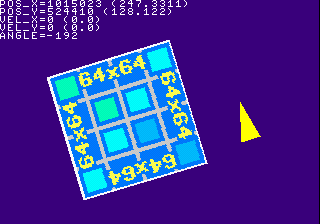

# Chapter 1.6: Using the CD-ROM

So you\'ve managed to make it this far in this tutorial series and have
wrapped your head around uploading textures to VRAM, drawing sprite
primitives with the GPU, handling controller input and rotating sprites
using fixed-point integer math, you should be good to go at making a
simple game with the knowledge you\'ve gained so far. However, there\'s
one more thing to learn that\'s very important to know in this endeavor
before going forward and that is using the CD-ROM.

The most obvious use of the CD-ROM drive on the PlayStation is, well, to
load data files from of course. Such files range from texture images, to
level data and even your program executable that the console loads
during the boot process. You can only go so far by including resources
into your PS-EXE as the console only has 2 megabytes worth of RAM, and
more importantly, they take up memory space that cannot be reclaimed
even when they are no longer needed (ie. texture images).

This chapter goes over the basic usage and operation of the CD-ROM
library for reading files from the CD-ROM.

**Compatible with PSn00bSDK:** Yes

## Tutorial Index

- [Workings of the CD-ROM](#workings-of-the-cd-rom)
- [Ways of Accessing the CD-ROM](#ways-of-accessing-the-cd-rom)
- [Using the CD-ROM Library](#using-the-cd-rom-library)
- [Implementation](#implementation)
- [Creating the CD Image](#creating-the-cd-image)
- [Conclusion](#conclusion)

## Workings of the CD-ROM

Before going into the know-abouts on using the CD-ROM we shall first
look into a brief explanation of how the CD-ROM format works, as
understanding some of the inner workings of the format will aid you
greatly in understanding the CD-ROM drive as you develop software for
the PlayStation.

### CD-ROM Structure

A CD-ROM typically consists of a Table-of-Contents or TOC and a huge
spiral track that spans the entire surface of the disc containing
sectors of binary data running along the track. The TOC contains
information about the location of tracks written on the disc, their
pregap and their type of track, a track in this case being the track
number to your favorite song in a music CD. The TOC would also contain
information of the next writable location in multi-session discs, which
would in turn contain another TOC of the next session but this only
really applies to CD-R discs.

PlayStation game discs typically contain only one track, with the
exception of games, usually early titles, using Red Book CD Audio tracks
for music immediately after the first data track of the disc.

### CD-ROM Sectors

A CD-ROM sector is a small data block of 2352 bytes but this only
applies to plain CD audio tracks, as the usable sector size is reduced
to 2048 bytes for data storage (ie. files). The remaining space of the
CD-ROM sector is taken up by sync and address bytes used to allow for
precise logical block addressing of the disc, alongside error detection
and correcting codes to help maintain data integrity of each data
sector. This sector format is known as Mode1, with a similar format used
by the PlayStation being Mode2/Form1 from the CD-ROM XA specification as
used by the Philips CD-i.

As far as the PlayStation is concerned, the console only reads the data
part of the sector on data reads, with the sync/address and EDC/ECC
correction handled transparently by the hardware unless instructed to
ignore EDC/ECC correction on data reads or to read whole sectors
including their EDC/ECC data.

### CD-ROM XA Extensions

As the PlayStation inherits the CD-ROM XA features from the CD-i as Sony
co-developed the Green Book standard with Philips, the console supports
playing back of special ADPCOM compressed audio tracks, most commonly
known as XA audio.

XA audio are basically special audio tracks compressed using ADPCM, with
a maximum sample rate of 37.8KHz mono or stereo. Unlike regular Red Book
CD Audio tracks XA audio tracks are interleaved with eight different
audio tracks at once (the interleave can be doubled, tripled and
quadrupled by using mono and/or 18.9KHz sample rate) and is played at
double the speed of plain CD Audio. However, the hardware only supports
playing one audio channel at a time.

This has some advantages, for one the drive does not need to change
speed when going from audio playback to data reading which can help
improve load times. Secondly, XA audio tracks take up less space overall
especially when the XA audio data is laid out properly (ie. all audio
channels are of roughly the same length to one another). Thirdly, XA
audio data can be interleaved with data sectors, and is used for video
playback. The Data/XA Audio interleave also explains why some files on a
PlayStation game disc (usually .STR video files) cannot be accessed
directly under most computer operating systems, usually resulting in
read errors.

However, XA audio has one downside and that is it tends to skip during
normal playback more than when playing back regular CD Audio tracks.

There is one more feature of XA audio that\'s seldom used and that is
channel switching during playback. This would be useful for adding
dynamic music to a game by switching to different channels of different
tangents of a level theme depending on the area the player is currently
at. One game that makes use of this feature is Klonoa: Door to
Phantomile.

### The 650MB Limit

Even though the PlayStation can read 700MB discs it cannot read more
than 650MB of the disc as the console\'s CD-ROM controller does not take
larger discs into account, as the console was designed before such discs
ever existed and the original CD-ROM specification specifies 650MB as
the standard capacity.

## Ways of Accessing the CD-ROM

There are two possible methods for accessing the CD-ROM of the
PlayStation that will work on both PsyQ/Programmer\'s Tool and
PSn00bSDK. The first method and one that is seldom used is the CD-ROM
functions included in the console\'s BIOS, which consists of calling
**\_96\_init()** to initialize the BIOS CD-ROM subsystem and using the
BIOS file I/O functions such as **open()** and **read()** with the
cdrom: device name. Whilst this method is technically the most efficient
option as it does not introduce any code overhead to your PlayStation
project as the functions already reside in the console itself, the BIOS
CD-ROM functions are rather limited and in a good number of cases,
unstable.

For one, calling **\_96\_init()** clears all but the DMA channel for the
CD-ROM controller, breaking the GPU library unless you call the function
before **ResetGraph()**. The BIOS functions are also quite slow and does
not support asynchronous reads, even though the hardware itself clearly
supports such operations. It does not even support playing CD Audio nor
XA audio tracks directly, so a different method is often most desired.

The other, more preferable method is to use the CD-ROM library called
libcd in PsyQ/Programmer\'s Tool and psxcd in PSn00bSDK respectively.
Not only is it faster and more stable than the BIOS CD-ROM functions at
the cost of some overhead, but it also offers greater control of the
CD-ROM hardware as well. Playing CD Audio and XA audio included.

## Using the CD-ROM Library

Using the CD-ROM library is quite simple in principle. The first thing
to be done is to initialize the CD-ROM library by calling the function
**CdInit()**. This function not only initializes the CD-ROM hardware but
also the CD-ROM library itself.

### Initializing the CD-ROM {#cdinit}

After calling **ResetGraph()** in your init routine you can then call
**CdInit()** to initialize the CD-ROM library.

    int CdInit(void)

The behavior of this function is very identical in both SDKs, but the
PsyQ/Programmers Tool implementation insists that a CD must be inserted
otherwise the function will output a lot of error messages to stdout and
fail to initialize. PSn00bSDK\'s implementation does not throw errors
when no disc is inserted, as it is written with utility style programs
that don\'t always need to read the disc in mind.

After calling this function, all CD-ROM functions exposed by the library
should be usable.

### Locating a File {#locatefile}

Now that the CD-ROM library is initialized the next step is to locate a
file on the disc to be read. Unlike the BIOS CD-ROM functions, the
CD-ROM library does not have a concept of file handles and instead,
files are read directly from their logical position on the disc.
Conveniently, no files on a CD-ROM are fragmented so file read
operations from the CD-ROM are quite simple and pretty straight forward.

Locating a file on the disc is done by using **CdSearchFile()**.

    CdlFILE* CdSearchFile(const char *filename, CdlFILE *loc)

This function will search the CD-ROM file system for the file specified
by *filename* and stores information about the file, such as it\'s
logical position and file size, to a **CdlFILE** struct specified by
*loc*. This information is all we need to read a file from the disc. The
file name must contain an absolute path from the root directory of the
disc as the CD-ROM library has no concept of current directories. The
file path must additionally end with a file version identifier, usually
;1.

The return value is just a pointer to the struct specified by *loc*, but
NULL is returned if the file name specified does not exist.

### Reading a File {#readfile}

Now that the file we want to read has been located, the next logical
step is to read it\'s contents. This is done by using two CD-ROM
functions; **CdControl()** and **CdRead()**.

**CdControl()** is kind of a multi-purpose function as it is used to
issue raw commands directly to the console\'s CD-ROM controller and can
be used to make the controller do all kinds of things including CD audio
playback, but this will be covered in greater detail at a later chapter.

For this instance, we\'ll be using **CdControl()** to issue a
**CdlSetloc** command to the CD-ROM controller with the location of the
file we just located.

    int CdControl(u_char com, u_char *param, u_char *result);

*com* specifies the command to be issued (**CdlSetloc** in this case)
while *param* should be a pointer to the *loc* element in the
**CdlFILE** struct we obtained from the **CdSearchFile()** call earlier.
*result* can be ignored in this instance so NULL can be specified for
that argument. *result* is where return data from the CD-ROM controller
would be stored to if a small buffer is specified.

The reason we must issue a **CdlSetloc** command is it sets the target
location for a read, seek or play operation. The CD-ROM hardware does
not yet move it\'s optical pickup when **CdlSetloc** is issued alone,
seeking only occurs when either of the aforementioned disc operations
have been issued and that a target location set by issuing **CdlSetloc**
was set prior.

And finally, we can now start a read operation by calling the
**CdRead()** function.

    int CdRead(int sectors, unsigned int *buf, int mode)

As the name says it all, this function starts a data read operation from
the disc starting from the logical position specified by a previously
issued **CdlSetloc** command. *sectors* specifies the number of sectors
to read from the disc, the exact number can be determined by taking the
*size* field in the **CdlFILE** struct, adding it by 2047 then divide by
2048. More will be explained why it had to be computed that way later.
The sectors read are then stored to *buf*, which must point to a buffer
large enough to contain all the sectors to be read. *mode* specifies the
CD-ROM mode to use for the read operation, usually **CdlModeSpeed** is
needed for all file read operations so data is read at full speed.

If you haven\'t guessed from the brief explanation of the operation of
CD-ROMs earlier in this chapter, each sector is 2048 bytes long. And
because **CdRead()** only reads in sector units you can only read data
in multiples of 2048 bytes. The logical position of files stored on the
CD-ROM are also addressed in multiples of 2048 bytes.

The BIOS CD-ROM functions are also limited to reading files in units of
2048 bytes and file seeks are limited to multiples of 2048 bytes as
well. Because of this, it is much faster to just load the entirety of a
file into memory and parse the file from there, especially as performing
several small seeks and read operations would be quite slow, even moreso
as the PlayStation\'s CD-ROM hardware doesn\'t have very fast access
times.

Once **CdRead()** has been called and the PlayStation\'s optical pickup
seeks to the file\'s location and begins reading data, the memory buffer
specified for *buf* should start filling with data from the file being
read. However, the **CdRead()** function finishes almost immediately and
the buffer may not yet contain the file you\'re reading yet, so another
step is required to make sure the buffer is filled with all the contents
of the file you want to load.

    int CdReadSync(int mode, unsigned char *result)

This function will wait until the **CdRead()** operation is actually
completed if *mode* is set to zero. If it is non-zero the function
returns the number of sectors remaining in the read operation. This is
useful if you want to have a animated loading screen or some such. If a
buffer is specified in *result* the most recent CD-ROM status is written
to that buffer, but it can be left NULL if not needed.

The asynchronous nature of the **CdRead()** function may be utilized for
implemented animated loading screens and such.

### Finished Routine

With all that taken in, a simple CD-ROM read routine should like this.

    CdlFILE filePos;
    int     numsecs;
    char    *buff;

    /* locate the file on the CD */
    if( CdSearchFile( &filePos;, "\\TEXTURE.TIM;1" ) == NULL )
    {
        /* print error message if file not found */
        printf( "File was not found." );
    }
    else
    {
        /* calculate number of sectors to read for the file */
        numsecs = (filePos.size+2047)/2048;
        
        /* allocate buffer for the file */
        buff = (char*)malloc( 2048*numsecs );
        
        /* set read target to the file */
        CdControl( CdlSetloc, (u_char*)&filePos.loc;, 0 );
        
        /* start read operation */
        CdRead( numsecs, (u_long*)buff, CdlModeSpeed );
        
        /* wait until the read operation is complete */
        CdReadSync( 0, 0 );
    }

You may notice that the file size has to be incremented by 2047 then
divided by 2048. This is to make sure that the sector count calculated
would cover the entirety of a file that is not a perfect multiple of
2048 bytes. If the file to be read were like 1536 bytes, the whole file
would be read as one whole sector with the excess bytes being nothing
more but padding.

You also have to remember that data reads from the CD are still
multiples of 2048 bytes, so the read buffer must be allocated in
multiples of 2048 bytes to avoid buffer overflow bugs, which would in
turn trash the memory heap.

## Implementation

To keep things simple we\'ll just implement it on top of the exisitng
sample program from the last chapter. Basically instead of reading the
sample texture from an array we\'ll load the texture file from the
CD-ROM. This can be quickly implemented by implementing our CD-ROM file
read routine as a nice little function.

    char *loadfile( const char *filename )
    {
        CdlFILE filePos;
        int     numsecs;
        char    *buff;
        
        buff = NULL;
        
        /* locate the file on the CD */
        if( CdSearchFile( filename, &filePos; ) == NULL )
        {
            /* print error message if file not found */
            printf( "%s not found.", filename );
        }
        else
        {
            /* calculate number of sectors to read for the file */
            numsecs = (filePos.size+2047)/2048;
            
            /* allocate buffer for the file (replace with malloc3() for PsyQ) */
            buff = (char*)malloc( 2048*numsecs );
            
            /* set read target to the file */
            CdControl( CdlSetloc, (u_char*)&filePos.loc;, 0 );
            
            /* start read operation */
            CdRead( numsecs, (u_long*)buff, CdlModeSpeed );
            
            /* wait until the read operation is complete */
            CdReadSync( 0, 0 );
        }
        
        return( buff );
        
    } /* loadfile */

The sample program from the last chapter will be used to demonstrate the
usage of the function, to load the texture image from CD rather than
loading from an array. The ever growing sample program should be like
this. Tweak the code as you see fit to make it work with the SDK you\'re
using.

    #include <sys/types.h>   // This provides typedefs needed by libgte.h and libgpu.h
    #include <stdio.h>    // Not necessary but include it anyway
    #include <psxetc.h>   // Includes some functions that controls the display
    #include <psxgte.h>   // GTE header, not really used but libgpu.h depends on it
    #include <psxgpu.h>   // GPU library header
    #include <psxapi.h>

    #define OTLEN 8         // Ordering table length (recommended to set as a define
                            // so it can be changed easily)

    DISPENV disp[2];        // Display/drawing buffer parameters
    DRAWENV draw[2];
    int db = 0;

    // PSn00bSDK requires having all u_long types replaced with
    // u_int, as u_long in modern GCC that PSn00bSDK uses defines it as a 64-bit integer.

    u_int ot[2][OTLEN];    // Ordering table length
    char pribuff[2][32768]; // Primitive buffer
    char *nextpri;          // Next primitive pointer

    int tim_mode;           // TIM image parameters
    RECT tim_prect,tim_crect;
    int tim_uoffs,tim_voffs;

    // Pad stuff
    #define PAD_SELECT      1
    #define PAD_L3          2
    #define PAD_R3          4
    #define PAD_START       8
    #define PAD_UP          16
    #define PAD_RIGHT       32
    #define PAD_DOWN        64
    #define PAD_LEFT        128
    #define PAD_L2          256
    #define PAD_R2          512
    #define PAD_L1          1024
    #define PAD_R1          2048
    #define PAD_TRIANGLE    4096
    #define PAD_CIRCLE      8192
    #define PAD_CROSS       16384
    #define PAD_SQUARE      32768

    typedef struct _PADTYPE
    {
        unsigned char   stat;
        unsigned char   len:4;
        unsigned char   type:4;
        unsigned short  btn;
        unsigned char   rs_x,rs_y;
        unsigned char   ls_x,ls_y;
    } PADTYPE;

    u_char padbuff[2][34];

    // For the player triangle
    SVECTOR player_tri[] = {
        {   0, -20,  0  },
        {  10,  20,  0  },
        { -10,  20,  0  }
    };

    void display() {
        
        DrawSync(0);                // Wait for any graphics processing to finish
        
        VSync(0);                   // Wait for vertical retrace

        PutDispEnv(&disp;[db]);      // Apply the DISPENV/DRAWENVs
        PutDrawEnv(&draw;[db]);

        SetDispMask(1);             // Enable the display

        DrawOTag(ot[db]+OTLEN-1);   // Draw the ordering table
        
        db = !db;                   // Swap buffers on every pass (alternates between 1 and 0)
        nextpri = pribuff[db];      // Reset next primitive pointer
        
    }

    // CD loading function
    char *loadfile( const char *filename )
    {
        CdlFILE filePos;
        int     numsecs;
        char    *buff;
        
        buff = NULL;
        
        /* locate the file on the CD */
        if( CdSearchFile( filename, &filePos; ) == NULL )
        {
            /* print error message if file not found */
            printf( "%s not found.", filename );
        }
        else
        {
            /* calculate number of sectors to read for the file */
            numsecs = (filePos.size+2047)/2048;
            
            /* allocate buffer for the file (replace with malloc3() for PsyQ) */
            buff = (char*)malloc( 2048*numsecs );
            
            /* set read target to the file */
            CdControl( CdlSetloc, (u_char*)&filePos.loc;, 0 );
            
            /* start read operation */
            CdRead( numsecs, (u_long*)buff, CdlModeSpeed );
            
            /* wait until the read operation is complete */
            CdReadSync( 0, 0 );
        }
        
        return( buff );
        
    } /* loadfile */

    // Texture upload function
    void LoadTexture(u_int *tim, TIM_IMAGE *tparam) {

        // Read TIM parameters (PsyQ)
        //OpenTIM(tim);
        //ReadTIM(tparam);

        // Read TIM parameters (PSn00bSDK)
        GetTimInfo(tim, tparam);

        // Upload pixel data to framebuffer
        LoadImage(tparam->prect, tparam->paddr);
        DrawSync(0);

        // Upload CLUT to framebuffer if present
        if( tparam->mode & 0x8 ) {

            LoadImage(tparam->crect, tparam->caddr);
            DrawSync(0);

        }

    }

    void loadstuff(void) {

        TIM_IMAGE   my_image;       // TIM image parameters
        u_int       *filebuff;      // Pointer for the file loaded from the disc

        if( filebuff = (u_int*)loadfile( "\\TEXTURE.TIM;1" ) )
        {    
            // On successful file read, load the texture to VRAM
            LoadTexture(tim_my_image, &my;_image);

            // Copy the TIM coordinates
            tim_prect   = *my_image.prect;
            tim_crect   = *my_image.crect;
            tim_mode    = my_image.mode;

            // Calculate U,V offset for TIMs that are not page aligned
            tim_uoffs = (tim_prect.x%64)<<(2-(tim_mode&0x3));
            tim_voffs = (tim_prect.y&0xff);
            
            // Free the file buffer
            free( filebuff );
        }
        else
        {
            // Output error text that the image failed to load
            printf( "Error: TEXTURE.TIM file not found.\n" );
        }
    }

    // To make main look tidy, init stuff has to be moved here
    void init(void) {
        
        // Reset graphics
        ResetGraph(0);
        
        // Initialize the CD-ROM library
        CdInit();

        // First buffer
        SetDefDispEnv(&disp;[0], 0, 0, 320, 240);
        SetDefDrawEnv(&draw;[0], 0, 240, 320, 240);
        // Second buffer
        SetDefDispEnv(&disp;[1], 0, 240, 320, 240);
        SetDefDrawEnv(&draw;[1], 0, 0, 320, 240);

        draw[0].isbg = 1;               // Enable clear
        setRGB0(&draw;[0], 63, 0, 127);  // Set clear color (dark purple)
        draw[1].isbg = 1;
        setRGB0(&draw;[1], 63, 0, 127);

        nextpri = pribuff[0];           // Set initial primitive pointer address
     
        // load textures and possibly other stuff
        loadstuff();

        // set tpage of lone texture as initial tpage
        draw[0].tpage = getTPage( tim_mode&0x3, 0, tim_prect.x, tim_prect.y );
        draw[1].tpage = getTPage( tim_mode&0x3, 0, tim_prect.x, tim_prect.y );

        // apply initial drawing environment
        PutDrawEnv(&draw;[!db]);
        
        // Initialize the pads
        InitPAD( padbuff[0], 34, padbuff[1], 34 );
        
        // Begin polling
        StartPAD();
        
        // To avoid VSync Timeout error, may not be defined in PsyQ
        ChangeClearPAD( 1 );
        
        // Load the font texture on the upper-right corner of the VRAM
        FntLoad( 960, 0 );

        // Define a font window of 100 characters covering the whole screen
        FntOpen( 0, 8, 320, 224, 0, 100 );
     
    }

    int main() {
        
        int i;
        int pos_x,pos_y,angle;
        PADTYPE *pad;
        POLY_F3 *tri;
        SVECTOR v[3];
        
        TILE *tile;                         // Pointer for TILE
        SPRT *sprt;                         // Pointer for SPRT

        // Init stuff
        init();
        
        pos_x = ONE*(disp[0].disp.w>>1);
        pos_y = ONE*(disp[0].disp.h>>1);
        angle = 0;
        
        while(1) {
        
            // Parse controller input
            pad = (PADTYPE*)padbuff[0];

            // Only parse inputs when a controller is connected
            if( pad->stat == 0 )
            {
                // Only parse when a digital pad, 
                // dual-analog and dual-shock is connected
                if( ( pad->type == 0x4 ) || 
                    ( pad->type == 0x5 ) || 
                    ( pad->type == 0x7 ) )
                {
                    if( !(pad->btn&PAD;_UP) )            // test UP
                    {
                        pos_x += csin( angle );
                        pos_y -= ccos( angle );
                    }
                    else if( !(pad->btn&PAD;_DOWN) )     // test DOWN
                    {
                        pos_x -= csin( angle );
                        pos_y += ccos( angle );
                    }
                    if( !(pad->btn&PAD;_LEFT) )          // test LEFT
                    {
                        angle -= 16;
                    }
                    else if( !(pad->btn&PAD;_RIGHT) )    // test RIGHT
                    {
                        angle += 16;
                    }
                }
            }

            ClearOTagR(ot[db], OTLEN);      // Clear ordering table
            
            // Rotate the triangle coordinates based on the player's angle
            // as well as apply the position
            for( i=0; i<3; i++ )
            {
                v[i].vx = (((player_tri[i].vx*icos( angle ))
                    -(player_tri[i].vy*csin( angle )))>>12)+(pos_x>>12);
                v[i].vy = (((player_tri[i].vy*icos( angle ))
                    +(player_tri[i].vx*csin( angle )))>>12)+(pos_y>>12);
            }
            
            // Sort the player triangle
            tri = (POLY_F3*)nextpri;
            setPolyF3( tri );
            setRGB0( tri, 255, 255, 0 );
            setXY3( tri,
                v[0].vx, v[0].vy,
                v[1].vx, v[1].vy,
                v[2].vx, v[2].vy );
            addPrim( ot[db], tri );
            nextpri += sizeof(POLY_F3);
            
            // Print player coordinates
            FntPrint( -1, "POS_X=%d (%d.%d)\n", pos_x, (pos_x>>12), (pos_x&0xfff) );
            FntPrint( -1, "POS_Y=%d (%d.%d)\n", pos_y, (pos_y>>12), (pos_y&0xfff) );
            FntPrint( -1, "ANGLE=%d\n", angle );

            // Draw and flush the character buffer
            FntFlush( -1 );
            
            // Update the display
            display();
            
        }
        
        return 0;
    }

## Creating the CD Image

Once you\'ve got the code above compiled it won\'t do jack for now as it
doesn\'t yet have a CD to read the texture file from. This is where disc
image creation comes to play in this chapter.

In the old days, the only preferred way to create PlayStation CD images
was with the old, MS-DOS based BUILDCD tool from the old leaked PsyQ SDK
dump. This tool is quite difficult to use on modern computers these days
largely due to being a 16-bit MS-DOS program, and while Dosbox can be
used to get it going on a modern machine it is not exactly ideal, not to
mention is very slow.

To make image creation even more tedious with the old BUILDCD method the
resulting image file is of a special format intended for early CD
burners and special disc cutters, so another tool called STRIPISO is
used to convert the image file to that of a usable file format. However,
the conversion process does not convert the Table-of-Contents data
produced by BUILDCD as well, so having multiple tracks in the disc image
was not possible with this method.

While other, more conventional means of disc image creation like MKISOFS
would work, it is not exactly ideal for projects that use XA audio or
streaming data which require support for mixed Mode2/Form1 and
Mode2/Form2 not supported by MKISOFS so you\'d be stuck with having to
use BUILDCD in the old days. Well\... That is until
[MKPSXISO](https://github.com/lameguy64/mkpsxiso)
by yours truly came about, solving this disc image creation dilemma in
the PlayStation homebrew scene once and for all. Said tool was so useful
that it got used quite extensively around ROM hacking and game
translation groups\... Or so I heard.

### Creating a MKPSXISO Script

Kind of like BUILDCD, MKPSXISO uses a simple script system to define the
contents and layout of a CD image. However, it uses a XML based format
similar to that you\'d find in HTML webpage files, of which, in of
itself is quite simple especially if you use a good text editor such as
Notepad++ or nedit.

The following is a link to a sample XML script for this tutorial. You
must save the link as a file as otherwise your browser\'s going to treat
it as a web page. The file also contains comments that explains the
usage of the XML file.

[MKPSXISO Sample Script](chapter_1_6_files/mkpsxiso-sample.xml)

The script file assumes that the above C program is compiled as
**cdread.exe**.

### Creating the SYSTEM.CNF File

Before the ISO image can be created, a **SYSTEM.CNF** file must be
created and is a standard requirement for PlayStation game discs to
include. The **SYSTEM.CNF** file is a simple text file that defines a
few parameters. The most important being the **BOOT** variable.

    BOOT=cdrom:\cdread.exe;1
    TCB=4
    EVENT=10
    STACK=801FFFF0

The parameters that immediately follow it **TCB**, **EVENT** and
**STACK** are special parameters that change the way how the kernel is
set up for the game. The parameters in the sample script are typical
values used in most games, so they can be left alone.

Save the text file as **SYSTEM.TXT** as the script provided will rename
it as **SYSTEM.CNF** as the disc image gets created. This is done so
that editing the CNF file is made easier when need-be, such as changing
the executable name.

### Creating the disc image

Building the disc image with MKPSXISO is just a matter of simply
invoking it from the command line with the XML script as the argument.

    mkpsxiso mkpsxiso-sample.xml

If things go accordingly you should end up with a BIN/CUE image pair
named **cdtutorial**. Run the disc image in your preferred emulator and
the program from the last tutorial should work now, only there\'s now a
slight delay from loading data from the disc.

## Conclusion

Hopefully this chapter has cleared up a lot of things in regards to
reading data from the CD, something I feel is still not explained very
well. But then I haven\'t really kept up with the PlayStation homebrew
scene in a very long while. In the future, stuff like CD Audio and XA
audio playback will be covered.

And this concludes the basics chapter of this tutorial series, and if
you\'ve managed to reach this far after reading the first few chapters
you should be able to do quite a bit with 2D stuff on the console
now\... Provided you managed to absorb it all.

---

[Previous](chapter_1_5.md)  |  [Back to Index](index.md)

---
